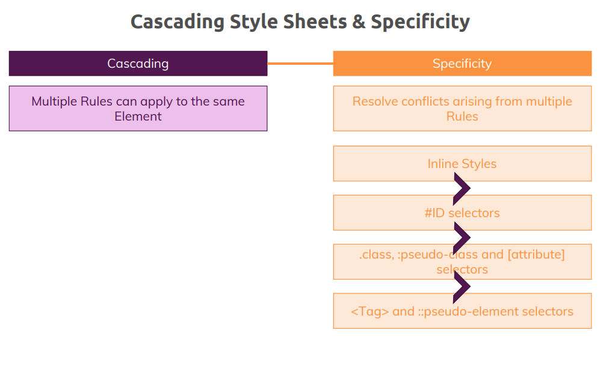
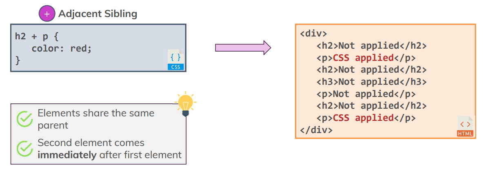
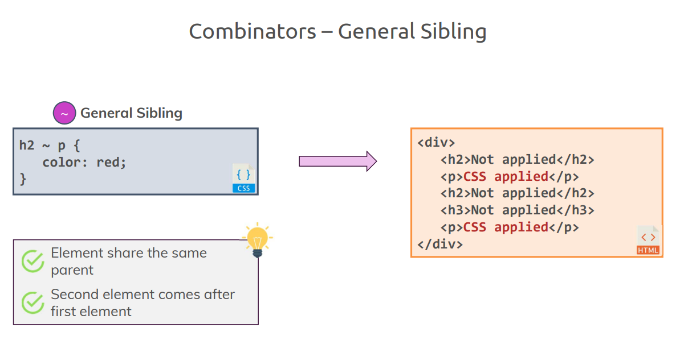
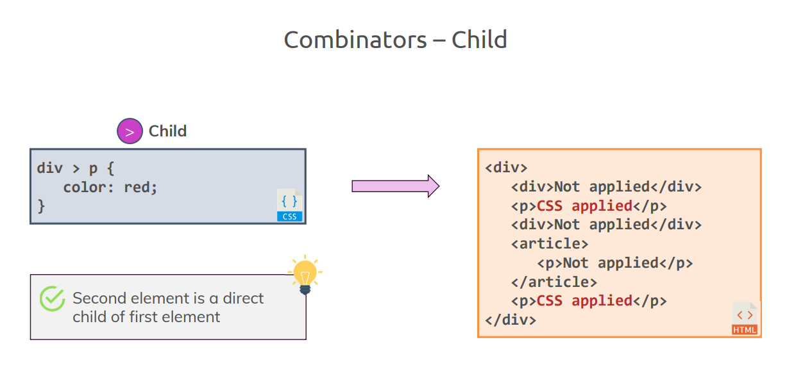
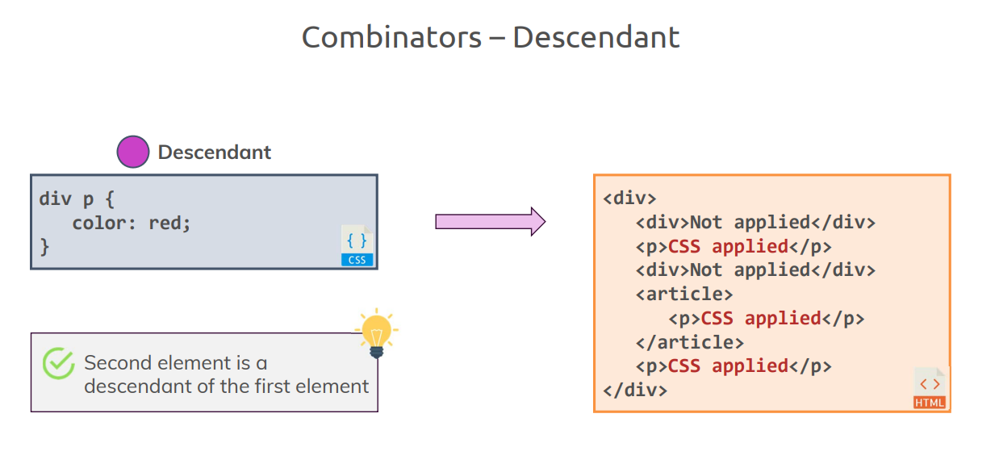
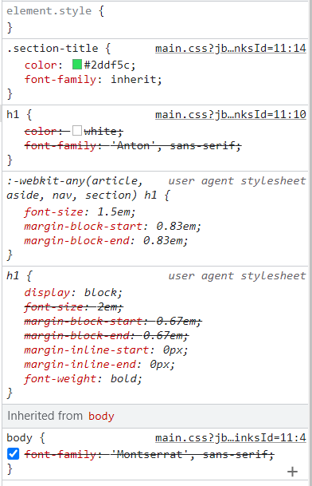

# CSS(Cascading Style Sheets)

### CSS 역사
- CSS 1 (1996년): 처음으로 웹페이지 모습을 개선할 수 있는 도구를 얻게됨
- CSS 2 (1998년)
- CSS 3 (In Development): CSS에 대한 개념, 접근법, 개발 방식이 바뀌었음

### CSS 추가하는 법
1. 인라인 스타일링
    1. html 태그의 style 속성 내부에 문자열로 CSS 선언을 적용하면 된다.
    2. 여기서 선언이란 무엇에 스타일을 지정할지와 어떻게 지정할지를 정의
    3. 여기서 무엇이란 프로퍼티를 의미한다.

```
<body>
    <main>
        <section style="background: #ff1b68">
            <h1>Get the freedom you deserve.</h1>
        </section>
    </main>
</body>
```  
여기서 `background`를 `property`라고 한다.  
이 `background` 프로퍼티에 값을 넣어 `section` 태그의 배경 스타일을 지정할 수 있다.

하지만 이 방식은 추천하지 않는다.
- 가독성이 떨어진다.
- CSS 를 수정하기 힘들다.
- 디버깅 하기 힘들다.


2. selector(선택자)를 이용
    1. html의 style 태그를 이용 한다.
    2. style 태그는 CSS 규칙을 따른다.
        1. CSS 규칙이란 결국 inline CSS 와 같이 프로퍼티 : 값과 같은 형태이다.

```
<head>
   <style>
      background:#ff1b68;
   </style>
</head>
<body>
    <main>
        <section style="background: #ff1b68">
            <h1>Get the freedom you deserve.</h1>
        </section>
    </main>
</body>
```  

`background:#ff1b68;` 는 `body` 태그의 어떤 요소에 `선언할건지` CSS 알려준다  
하지만 이때 `선택자`가 없기때문에 어떤 `body` 태그에 CSS를 적용해야 하는지 알 수 없다.

```
<head>
    <style>
        section {
            background: #ff1b68;
        }
    </style>
</head>
```  
`선택자(section)`을 추가 함으로써 CSS에 어떤 태그에 CSS를 적용할지 지정해 줄 수 있다.

3. 외부 스타일 시트를 이용
    1. `header` 태그에 `<link rel="stylesheet" href="main.css">` .css 파일을 추가
    2. 외부 CSS 파일을 사용하는 것을 추천
        1. HTML과 CSS 파일을 분리 할 수 있다.
        2. 재사용성이 높다.


## 선택자(selector)
1. Elements or Tag selector
    1. HTML 요소에 대해 스타일을 설정한다.
    2. ex) `h1 {
       color: white;
       font-family: 'Anton', sans-serif;
       }`
2. class selector(.)
    1. 클래스로 스타일을 정의할 수 있고, 동일한 클래스를 가진 모든 요소에 같은 스타일을 적용할 수 있다.
    2. HTML 태그의 `class` attribute 에 값을 넣어주면 된다.
    3. ex) `<section class="header"> Hi </section>`
    4. class 선택자는 `.`+ `calss 이름`을 이용한다.
    5. `.header {
       color: white;
       font-family: 'Anton', sans-serif;
       }`
3. Universal selector (*) : 전체 페이지에 모든 요소에 특정 스타일을 지정하고 싶을때
    1. `* {
       width: 100%;
       height: 100%;
       }`
4. ID selector(#)
    1. HTML `ID`속성을 이용해서 해당 요소에 하나의 스타일을 적용할 수 있다.
    2. ex) `<section id="header"> Hi </section>`
    3. `#header {
       width: 100%;
       height: 100%;
       }`
5. Attributes selector(속성 선택자)
    1. 같은 속성을 가진 모든 요소에 같은 스타일을 지정
    2. ex) `<button disabled>Click </button>`
    3. `[disabled] {
       color: red;
       }`

## Cascading 의 이해
```
h1 {
    color: white;
    font-family: 'Anton', sans-serif;
}
.section-title {
    color: #2ddf5c;
}
```
```
<body>
    <main>
        <section id="product-overview">
            <h1>Get the freedom you deserve.</h1>
        </section>
        <section id="plans">
            <h1 class="section-title">Choose Your Plan</h1>
        </section>
    </main>
</body>
```  

두 선택자`h1`과 `.section-title`은 두 번째 `h1` 태그와 일치한다.  
이떄 두 번째 `h1` 태그에 클래스를 추가하였다고 해서 선택에 벗어나는 게 아니다.  
누군가는 .css 파일에 선언한 순서대로 파싱하기 때문에 나중에 선언한 값이 기존 값을 덮어 쓴다고 생각할 수 있다.  
하지만 선언 순서를 바꿔도 `.section-title`의 스타일만 여전히 적용되는 것을 확인할 수 있다.

이때
```
h1 {
    color: white;
    font-family: 'Anton', sans-serif;
}
.section-title {
    color: #2ddf5c;
}
h1 {
    font-family: sans-serif;
}
```

font 를 변경하는 `h1` 선택자를 추가하면 두번째 `h1`태그의 font가 변경 되는 것을 볼 수 있다.  
이를 보면 `선택자를 사용할 때 순서는 여전히 중요한 것으로 보인다.`  
만약 클래스가 h1 태그의 스타일을 어떤 방법으로 덮어쓴다면 즉, 텍스트가 초록색으로 여전히 설정한다면  
font-family는 왜 지우지 않는 것일까??  


### 우선 순위

1. inline-style -> 위 그림의 element.style
    1. 우선 순위가 가장높음 정확하게는 `명시도`라고 하고 한다.
2. class selector : .section-title
    1. 아래 있는 h1 선택자 보다 클래스 선택자의 명시도가 높다.
3. 2개의 h1 선택자
    1. 이때 파일은 위에서 아래로 파싱 되기때문에 파일에서 나중에 선언한 선택자가 더 높은 우선순위를 가진다.
    2. 이때 h1 태그 안에서도 color 프로퍼티가 있지만 CSS 명시도에 의해 Class 선택자가 Element 선택자 보다 명시도가 높기 때문에 Class 에 해당하는 스타일 값이 적용 된다.
4. 브라우저 기본 CSS : :-webkiet-any ....
5. 상속된 CSS

즉, Cascading 이란 `여러 스타일이 같은 요소에 적용될 수 있다는 뜻`이다.  
이러한 규칙은 충돌을 낳을 수 있는데, 이때 `CSS 명시도`의 개념을 알고 있으면  
이를 해결할 수 있다.

### 정리
- Cascading: 여러 규칙이 같은 요소에 적용됨을 의미
- 이러한 규칙으로 인해 충돌이 발생할 수 있음
- 명시도 : 어떤 스타일이 더 높은 우선순위를 가지는지
    1. inline style : 다른 모든 스타일을 덮어씀
    2. ID Selector
    3. Class Selector And 의사 Class And [attribute] selector
        1. 같은 명시도에 있는 선택자들끼리 충돌이 발생하면 나중에 정의된 것이 명시도가 높다.
    4. Tag Selector

## 상속
어떤 요소가 부모 요소의 스타일을 상속한다는 의미  
만약 모든 h1 태그에 Anton 폰트를 적용하고 싶지 않다면 전역적인 `global` 스타일을 추가한다.  
이때 `*` 선택자를 추가하여 요소 전체에 스타일을 적용할 수 있다.


```
* {
    font-family: sans-serif;
}
```
단, `*` 선택자는 `명시도가 낮고` `CSS 가 화면의 모든 요소를 파싱하는 방식이라 비효율 적이다.`

보통 `body` 태그 선택자를 사용한다.  
`body`가 모든 컨텐츠를 감싸고 있음을 기억하자, 따라서 `body` 선택자에 특정 스타일을 하면 단른 하위 요소의 스타일을 바꿀 수 있다.  
`*` 선택자를 사용하는 것보다 효율적이다.
```
body {
    font-family: 'Montserrat', sans-serif;
}
```  

또한 계발자 도구를 통해서 요소들은 자신의 부모로부터 스타일을 상속 받는 다는 것을 확인할 수 있다.  
이는 바로 위의 부모 태그 뿐만 아니라 그 위에 존재하는 조상들로부터로도 직접적으로 또는 간접적으로 상속 받는다.  
또한 상속은 항상 가장 아래에 위치한다. 브라우저의 기본값보다도 우선순위가 낮다.


만약 어떤 스타일도 적용하지 않고 하나의 테그를 추가한다면 `body`에서 상속 받은 스탈이 적용된다.
```
        <section id="plans">
            <h1 class="section-title">Choose Your Plan</h1>
            <p>Believe Yourself!!</p>
        </section>
```

  
  
## 결합자 추가하기(Combinator)
### 이론
결합자를 이용하면 `규칙`을 좀 더 정확히 설정할 수 있고 선택자에 더 많은 정보를 전달함 으로써 요소를 선택할 수 있다.  
참고로 두개 이상의 선택자를 결합할 수 있다.  
주요 결합자  
1. 인접 형제 결합자(Adjacent Sibling) : +
    * 선택자 사이에 `+`를 붙여준다 : div + p { }
2. 일반 형제 결합자(General Sibling) : ~
   * 선택자 사이에 `~`를 붙여준다 : div ~ p { }
3. 자손 결합자(Child) : >
    * 선택자 사이에 `>`를 붙여준다 : div > p { }
4. 자손 결합자(Descendant) : space(공백)
    * 선택자 사이에 ` `(white space)를 붙여준다 : div  p { }

### Adjacent Sibling
  
  
첫번째와 마지막 `p` 태그에만 스타일일이 적용된것을 확인할 수 있다.  
두번째 `p`태그는 `h3` 태그가 바로 뒤에 오기 때문에 적용 대상이 아니다.  
즉, 이 두번째 `p`태그는 h2태그의 직속 형제가 아니다.
  
주의사항은 요소가 `동일한 부모를 공유하고 있어서 같은 레벨에 존재 햐야만 하고 ` 
`선택하고자 하는 두번째, 또는 세번째 요소가 반드시 선택하는 첫 번째 혹은 두번째 요소 다음에 위치해 있어야 한다.`  
  
### General Sibling

  
모든 `p` 태그에 스타일이 적용되어 있다.  
심지어 두번째 `p`태그는 `h2` 태그 바로 뒤에 있지 않는데도 적용 되어있다.  
일반 형제 선택자에서는 `h2` 형제가 있다는 점 자체가 중요하다.  
즉, 바로 앞에 위치할 필요 가 없다. 단지, 같은 레벨에 `h2` 태그와 `p`태그가 있기만 하면 된다.  
  
주의사항은 역시 같은 부모를 공유하기 떄문에 같은 레벨에 존재해야 하고 선택하고자 하는 태그 앞에  
첫번째 태그가 존재 하면 된다.

### Child

`article` 태그 안에 있는 `p` 태그를 제외한 `p`태그가 스타일이 적용되어 있다.  
자식 결합자는 `div` 태그 내 직속 자식인 `p`태그에만 해당 스타일을 적용시킵니다.  
물론, 둘 이상의 선택자도 결합시킬 수 있다.
  
### Descendant

  
이 결합자에서는 레벨이 중요하지 않다.  
보시다시피 모든 `p` 태그가 스타일이 적용되어 있다.  
`div` 태그의 직속 자식 여부 상관 없이 DOM 상에 div 태그가 있기만 하면 되는 거다.  
즉 , 직속 자식이지 않아도 두 번째 선택하려는 요소가 첫 번째 자식의 자손이기만 하면 된다.
  
### 정리
결합자는 좀 더 정확한 명령이 필요할 떄 사용해야 합니다.  
하지만 결합자 없이 직접 선택자를 사용할 떄에 성능이 좀 더 낫다는 것을 염두해야 한다.  
결합자 자체가 성능 떨어뜨리는 것은 아니고 어떤 선택자를 결합하느냐에 따라 달라진다.

### 예시
기존 예제에서 우리가 만든 `h1`태그 중에 하나를 기본 CSS 설정으로 변경하려면 어떻게 해야할까??  
1. 해당 CSS 에 가서 `font-family: inherit;` 를 추가한다.
   * inherit 키워드는 상속된 스타일을 사용하라는 명령어
   * 즉, 특정 프로퍼티에 대한 상속의 명시도를 증가시키는 작업이다.
```
.section-title {
    color: #2ddf5c;
    font-family: inherit;
}
```
  
위 처럼 `inherit;` 키워드가 적용되서 상속된 font가 체크 되어져 있는 것을 확인할 수 있다.  
이떄 `inherit` 키워드로 설정되어서 사용되지 않은 것처럼 줄이 그어져 있지만 `body` 에서 설정한 font 가 적용된 것을 확인할 수 있다.  
기존 CSS 화면  
  
`inherit` 적용된 화면  

  
하지만 이 방법은 역시 특정한 `class`만 변경해 주었기때문에 만약 다른 `h1` 태그 또한 기본 값을 적용하고 싶다면  
특정 `h1`태그에 id 속성을 추가해서 해결할 수 도 있지만 효율적이지 않다.(재사용성이 없다.)  
이럴때 사용하는 것이 `결합자(combinator)` 이다.
  
### 결합자를 이용하면 여러 선택자를 하나로 합쳐서 좀 더 정확히 원하는 바를 선택할 수 있다.
  즉, 원하는 `h1` 선택자에 결합자를 추가하여 어떤 `h1` 태그에 스타일을 적용할지 그 범위를 좁힐 수 있다.  
```
#product-overview h1 {
    color: white;
    font-family: 'Anton', sans-serif;
}
```
이런식 으로 결합자를 추가하면 위에서 추가한 `inherit` 키워드를 제거 해도 동일한 결과를 얻을 수 있다.  
또한 이런 결합자를 이용했을 때의 명시도는 기본 요소 선택자보다 그 명시도가 높다.