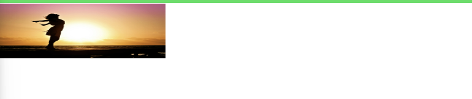

#Background & Images
## Background Property
### background-image (배경이미지)
기존에 우리가 적용했던 `background` 프로퍼티는 축약 프로퍼티이다.  
`background: url("freedom.jpg");`  -> ` background-image: url("freedom.jpg");` 변경해도 동일한 결과를 얻을 수 있다.  

### background-color (배경색)
배경의 색상을 변경할 수 있다.  
`background-color:red;`  
  
  
### background-size (배경 사이즈)
`background` 크기를 지정한다.  
`background-size`는 여러값을 가진다.
```
#product-overview {
    /*background: url("freedom.jpg");*/
    background-image: url("freedom.jpg");
    background-size: 100px;
    width: 100%;
    height: 528px;
    padding: 10px;
    margin-top: 43px;
    position: relative;
}
```

  
새로고침 하고 화면을 확인해보니 작은 이미지가 굉장히 많이 나오는 것을 확인할 수 있다.  
`background-size `값으로 `100px` 값 하나만 설정 했을때 그의미는 이미지 너비를 `100px`로 설정한 것이다.  
따라서 이게 자동으로 반복된다.  
만약, 이 반복을 끄거나 제어하려면 `background-repeat`프로퍼티를 사용해서 제어하면 된다.  

`background-size`값에 두번째 값을 주게 되면 예를 들어 `background-size: 300px 100px` 이런식으로 값을 주게되면  
이미지의 너비(width)와 높이(height) 둘 다 설정한 샘 이다.  
만약 높이를 설정하지 않으면 너비에 맞춰 자동으로 비율을 유지한다.  
  
  
물론 픽셀값 외에 백분율도 가능하다. `background-size: 50%` , `background-size: auto 100%`  
`width`값을 `auto`로 주면 이미지가 컨테이너 전체를 차지하지 않는다.
  
왜냐하면 컨테이너는 앱에서 다른 비율을 갖기 때문이다.  
대다수 웹 프로젝트가 이런 경우일 것이다. 즉, 컨테이너와 이미지가 일치할 경우는 거의 없다.  
이럴때 만약 `width:100%` 높이 값을 정하지 않거나 `auto`값을 주게 되면  
이미지가 컨테이너 너비의 전체를 차지하게 된다.  
왼쪽이나 오른쪽이 겹치지 않고 위나 아래도 겹치지 않는다.  
이미지 높이가 컨테이너와 일치하지 않아도 전체를 차지하게 된다.  
`이는 이미지가 자동으로 잘린것이다.` 이또한 우리가 조정할 수 있다.  
자르는 방식을 조정할 수 있다. 이역시 `background-size`에서 정의할 수 있다.  

### 이미지를 자르는 방식 cover
`background-size`값으로 `cover`이라는 값을 주면 `background-size: 100%`와 완벽하게 똑같다.  
즉, 컨테이너 너비에 맞추는 것이다.  
사실 `cover`의 정확한 기능은 컨테이너의 너비 또는 높이 중에서 어떤 것이 이미지 정렬에 더 중요한지 알아내는 것이다.  
다시말해서, 이미지의 비율은 너비가 높이보다 크다. 즉, 가로 모드이다. 이는 컨테이너도 마찬가지이다.  
그래서 `cover`는 너비가 100%여야 한다는 사실을 알 수 있다.  
만약 세로 모드라면 그 반대가 된다.  
  
쉽게 말해서 `cover`는 언제나 이미지가 컨테이너를 채우게 설정한다.  
따라서 컨테이너에 여백이 없게 만드는 가장 좋은 설정중 하나이다.

### 이미지를 자르는 방식 contain
`contain`은 전체 이미지가 컨테이너에 나타나게 만든다.  
오른쪽 여백이 있는데 이는 `contain`은 이미지가 컨테이너 전체를 채우지 않기 때문이다.  
전체를 채우는 것이 아니라 이미지 전체를 컨테이너에 표시하도록 하기 때문이다.


  

### background-repeat (배경 반복)
  
`background-repeat: no-repeat;`값을 설정하면 반복되는 이미지가 사라지는 것을 확인할 수 있다.  

  
혹은 `repeat-x`라는 값을 주게 된다면 이미지가 x축으로 반복해서 출력한다.  
반대로 `repeat-y`라는 값을 주면 y축으로 반복해서 출력된다.
  
## background-position (배경 위치)
`background-position` 프로퍼티의 여러 사용법이 있지만 먼저 간단하게 값으로 `px`값을 지정해 보자  
`background-position: 20px`  
  
위에서 볼 수 있듯이 이미지가 오른쪽으로 20px 이동한 것을 확인할 수 있다.  
이로소 우리는 첫번째 값을 지정해주면 `x축`값을 정의한다는 것을 확인할 수 있다.  
이는 이미지 및 컨테이너의 왼쪽 모서리를 기준으로 `20px` 떨어진 곳으로 이동한다.  
  
이상태에서 두번째 값을 지정하게 되면, `background-position: 20px 50px`  
우리는 첫번째 값이 x축을 변경하였으니 `y축`값이 변경될거라고 예측할 수 있다.  
  
역시 이미지 및 컨테이너의 위쪽을 기준으로 50px 떨어진 곳으로 이동한다.  
  
`background-position`의 값으로 백분율 값을 지정하면 어떻게 될까??  
`background-position: 10%` 값을 지정하게되면  
  
왼쪽을 기준으로 `10%` 떨어진 곳으로 이동하는 것이 아니라 `왼쪽 여백`이 사라진 것을 확인할 수 있다.  
`백문율 값`의 경우 조금 다르게 적용하기 때문이다.  
`백문율 값`을 사용하게 되면 이미지가 컨테이너에 포함되지 않고  
초과되는 부분이 얼마나 되는지 정의한다.  
예를 들어 `background-position: 0% 10%;`이렇게 설정하면 `x축으로` 초과되는 부분은 없고  
`y축으로 10%`만큼 이미지가 초과되는데 자세히보면 사진이 살짝 아래로 내려간 것을 확인할 수 있다.  
즉, 이미지를 초과되는 영역을 조정함으로써 컨테이너 안에서의 위치를 조정할 수 있다.  
위와 같은 방식으로 수동으로 `이미지`의 위치를 지정할 수 있고   

`background-position: center(50% 50%)`처럼 사전에 정의된 값을 사용할 수도 있다.  
`background-position: left top 0 0`  
`background-position: left 10% top 20% ;`  
  


