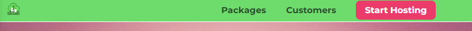
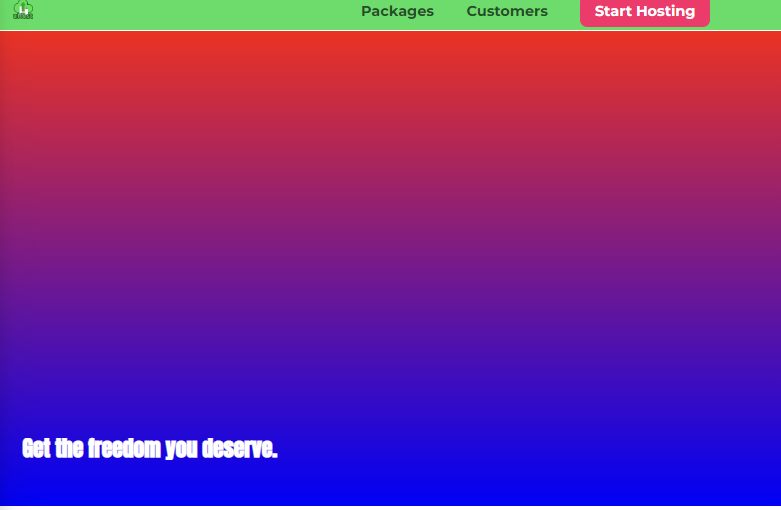
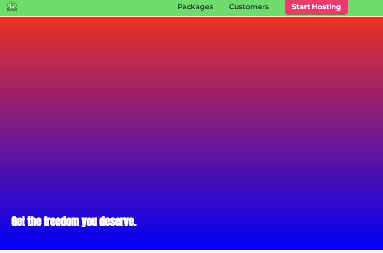
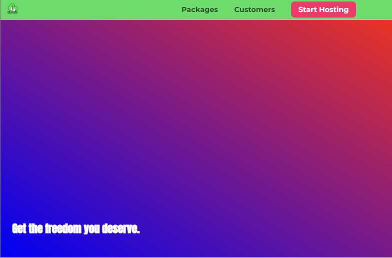
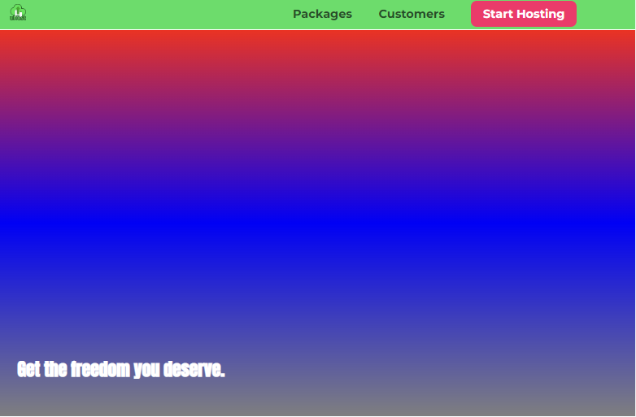
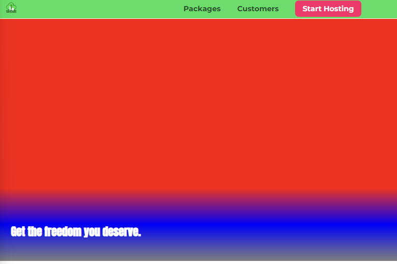

# Image CSS
## 이미지 스타일링
```
        <div>
            <a href="index.html" class="main-header__brand">
                
            </a>
        </div>
```
기존 우리의 로고를 이미지로 대체해보자  
이때  `a`태그의 스타일링에 높이를 `font-size`와 같은 값으로 설정하여 높이를 제한해보자
```
.main-header__brand {
    color: #0e4f1f;
    text-decoration: none;
    font-weight: bold;
    font-size: 22px;
    height:22px
}
```  
  
  
예상과 다르게 별다른 이미지가 여전히 크게 보여지는 것을 확인할 수 있다.  
그 이유는 `컨테이너에 높이를 지정할 때 .main-header__brand는 컨테이너지 이미지 요소가 아니기 때문이다.`  
따라서 `컨테이너에서는 높이를 지정해도 이미지는 아무런 영향을 받지 않는다.`  
  
우리는 여기서 기본 동작 방식을 기억해야한다.  
기본 동작 방식은 이미지 태그로 이미지를 가리키면 원본 이미지의 높이와 너비가 적용되어 문서에 삽입된다.  
이때 주변 요소의 너비와 높이가 어떻든지 상관하지 않는다.  
  
  
그래서 이미지에도 영향을 주려면 두가지 절차를 거쳐야 한다.
* 먼저 이미지를 선택해야한다.
   * `.main-header__brand img {}`
   * 이때 height: 22px를 적용하면 이미지의 높이가 작아진것을 확인할 수 있다.(width 값도 동일)
   * 그러면 height: 100% 값을 주면 부모 컨테이너의 높이에 맞춰서 높이가 설정될까?(width 값도 동일)
     * 하지만 적용되지 않는다. 이미지에 높이 `100%`를 적용하니 다시 원본 이지파일의 높이 값이 적용되었다.
     *   
   * 부모 컨테이너가 블록 요소인지 확인한다.
  
이미지는 컨테이너의 높이를 따르지 않고있다.  
이유가 무엇일까??  
이는 이미지의 상위 컨테이너가 `인라인` 요소이기 때문이다.

```
.main-header__brand {
    color: #0e4f1f;
    text-decoration: none;
    font-weight: bold;
    font-size: 22px;
    height: 22px;
    display: inline-block;
}
.main-header__brand img {
    height: 100%;
}

```
  
  
  
## 팁
  
브모 컨테이너가 `inline-block`일때 `box-shadow` css를 적용했을 때  
이때 이미지 아래에 보기 싫은 여백이 나온다.  
이는 인라인 요소의 버그로 해당 이미지에 `vertical-align: bottom`,`vertical-align: top`값을 주면 밑에 여백이 사라진다.  
  
## 선형 그라데이션
`먼저 선형과 원형 그라데이션 모두 이미지로 취급한다는 것이다.`  
`linear-gradient()` 함수는 두개의 인자를 받는데 첫번째 인자로는 그라데이션 방향  
만약 첫번째 인자가 색상이라면 생략할 수 있다.  
이때 기본 방향은 수직이다.
```
#product-overview {
    background: url("freedom.jpg") left 10% top 20%/cover no-repeat border-box;
    background-image: linear-gradient(red ,blue);
    width: 100%;
    height: 528px;
    padding: 10px;
    margin-top: 43px;
    position: relative;
}
```
  
  
이때 첫번재 인자로 방향을 설정할 수 있는데 예를 들어 `background-image: linear-gradient(to bottom,red ,blue);`  
당장 보면 낯설지만 CSS가 이해할 수 있는 구문이다.  
위 의미는 위에서 아래로 내려오는 방향이다.  
  
  
`background-image: linear-gradient(to left bottom,red ,blue);`  
  
  
위와 같이 방향으로 그라데이션 방향을 방향으로 지정할 수도 있고 각도로도 지정할 수 있다.  
`background-image: linear-gradient(30deg,red ,blue);`  
  
  
뿐만 아니라 색상도 원하는 만큼 설정할 수 있다.  
`background-image: linear-gradient(30deg,red ,blue,green,yellow,#fa923f);`  
background-image: linear-gradient(180deg,red,transparent);  
  
또한 어떤 색상이 어디서 시작하고 어디서 끝나는지도 설정할 수 있다.  
`background-image: linear-gradient(180deg,red,blue,rgba(0,0,0,0.5));`  
  
각 색상이 3분의 1씩이 차지하는 것을 볼 수 있다.  
`background-image: linear-gradient(180deg,red 70%,blue,rgba(0,0,0,0.5));`  
색상 옆에 해당 색상이 차지하는 비율을 값을 설정할 수 있다.  
  
