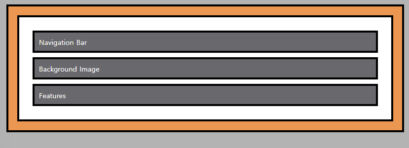

# CSS로 요소배치
## Position Elements
요소들을 배치하는 이유와 방법은 무엇일까??  
  
먼저 간단한 예제를 하나 들어보자  
```
<html
    <body>
        <div></div>
        <div></div>
        <div></div>
    </body>
</html>
```
  
HTML 안의 body 요소 안에 3개의 `div` 블록 레벨 요소가 있다고 가정해보자  
블록 레밸 요소의 특징으로는 보통 그 위치에 어떤 내용을 표시하기 위해서 해당 열의 모든 공간을 차지한다.  
  
따러서 하나의 블록 밑에 다음 블록이 표시된다.  
이건 `div` 태그가 블록 레벨 요소이고 `문서 대열(document flow)`을 따르기 떄문이다.  
`document flow`라고 하면 일반 적인 `HTML` 문서 내의 모든 요소(element)가 브라우저 창에 어떻게 배치되는지를 나타내는 용어이다.  
HTML 문서는 일반적으로 위에서 아래로 읽혀지며, 각 요소는 이전 요소의 아래에 위치하게된다.  
따라서 HTML 문서 플로우는 각 요소가 브라우저 창 내에서 표시되는 위치와 크기를 결정하는 데 중요한 역할을 한다.  
  
그렇다면 자동으로 적용되는 어떤 프로퍼티가 존재해서 자동으로 요소들이 특정 `document flow`를 따르는건 아닐까??  
정답은 `그렇다.` 이다, `position`이라는 프로퍼티는 `HTML` 코드에 자동으로 기본값이 적용되어있다.(`static`이라는 값이 적용)  

  
그래서 기본값인 `static`이 적용되면 이전 예제에서 확인한 것처럼 그 값에 맞게 문서가 작동한다.  
그런데 이 요소들의 `document flow`를 변경하고 싶을 때가 있다.  

  
이말은 위와 같은 그림처럼 `HTML`요소의 오른쪽 위에 배치한다거나 와 같이  
웹사이트에서 요소를 내가 원하는 위치에 배치해야 할때가 있다.  
그러기 위해서는 기본값 외에 다른 값을 사용해야한다.   
즉, `position` 프로퍼티의 값을 기본값외에 다른 값으로 특정해야 한다.  
  
### position 프로퍼티의 value (positioning context)
1. static(기본값)
2. absolute
3. relative
4. fixed
5. sticky   
  
핵심은 `position` 프로퍼티에 기본값 외에 다른 값을 할당함으로써  
웹사이트 요소의 실제 위치를 변경할 수 있다는 것이다.  
물론 `position` 프로퍼티는 위치를 변경하고 싶다는 것을 나타내지만  
어떻게 위치를 바꾸고 싶은지도 특정해 줘야한다. 즉, 요소가 표시될 위치를 지정해 주어야한다는 의미다.  
  
좀더 자세히 설명하자면 우리가 `div` 태그에 `position` 프로퍼티에 기본값(static)말고 다른값을 할당하게 되면  
그러면 이 `div` 요소가 다른 위치로 이제 이동하게 만들 수 있다.  
이때 이 요소가 어디로 움질일지 알려줘야 하는데 이떄 4가지 선택지를 고려할 수 있다.  
1. top
2. bottom
3. left
4. right
  
이 4가지 옵션을 통해서 요소들의 위치를 변경할 수 있다.  
이떄 예를들어 `top : 20px`값을 요소에 적용하게 되면 어떻게 되는 걸까??  
이 `20px`이 가리키는 게 무엇일까?? 즉, 어디를 기준으로 `20px`값만큼 위로 이동하는 것일까?  
  
여러가지 경우가 있지만 첫번째로 `요소 자체에 관한 선언인 경우`이다.  
이말은 `이 요소의 위치를 기준으로 `20px`만큼 위로 올려달라는 의미` 이다.  
  
다른 경우로는 `20px`이 `거리를 가리키는 경우`이다.  
예를 들어 뷰포트의 위쪽에서 `20px` 떨어져 있다는 의미가 되는 것이다.  
즉 `이 뷰포트의 기준은 `html` 요소나 `body` 요소 아니면 다른 요소를 기준으로 삼을 수도 있다.`  
이때 `뷰포트`는 웹페이지에서 보이는 부분을 뜻한다. 즉, 브라우저 창으로 해석해도 좋다.)  
  
이러한 선택지들을 `positioning context`라고 하며  
의미는 어느 것을 기준으로 위치를 변경할지를 나타낸다.


## fixed
  
먼저 기본적인 화면에 스크롤을 할 수 있게 `html`태그의 `height`값을 넉넉하게 설정하여 스크롤를 생성하였다.  
  
```
    <body>
        <div class="parent">
            <div class="child-1">Navigation Bar</div>
            <div class="child-2">Background Image</div>
            <div class="child-3">Features</div>
        </div>
    </body>
```
먼저 `position` 기본값을 변경하지 않고 `top`, `right`, `bottom`, `left` 프로퍼티를 사용해보자.  
```
.parent .child-1 {
    top:100px;
}
```
페이지를 새로고침하면, 요소의 위치가 변경되지 않았음을 확인할 수 있다.  
즉, 배치 변경을 적용하기 위해서는 `반드시 static 이 아닌 값을 적용해야 한다.`  
다음으로 `top` 프로퍼티를 제거하고 `position` 프로퍼티의 값을 `fixed`로 변경해 보자.  
```
.parent .child-1 {
    position: fixed;
}
```
  
배치되는 방식이 변경된 것을 확인할 수 있다.  
여기서 눈에 띄는 특징이 있다.  

먼저 요소의 너비가 눈에 띄게 짧아졌다는 점이다. 마치 인라인 요소 같은 모습을 보여준다.  
두번째는 이 `position: fixed`가 적용된 요소는 이제 다른 요소들이 없는 것처럼 배치되어 있다.  
두번째 요손인 `Background Image`가 기존`Navigation Bar`가 있던 자리를 차지하고 있다.  
`Navigation Bar`가 존재하는데도 `Background Image`가 완전히 똑같은 배치에 들어가 있다.  
  
이건 `position : fixed` 값을 적용함으로써 `Navigation Bar`요소를 기존 `document flow`에서 뺴냈기 때문이다.  
다시말해, 다른 요소들이 보기에 `Navigation Bar` 요소는 더 이상 존재하지 않는 것이다.  
새로운 선언을 적용했기 때문이다.  
  
그러면 너비가 줄어든 것은 왜일까??  
먼저 CSS 코드에서 `width` 값을 변경해보자 만약 인라인 요소라면 `width`값을 변경해도 아무런 여향이 없다.  
```
.parent .child-1 {
    position: fixed;
    width: 400px;
}
```
  
  
`width`값을 변경하고 확인하니 요소의 너비가 바뀐 것을 보아 인라인 요소로 생성되지는 않았다는 것을 확인할 수 있다.  
사실 `인라인 블록 요소가` 생겼을 뿐이다.  
  
### 정리
기존 문서 대열(document flow)에서 요소를 빼내 블록 레벨 요소의 작동 방식을 인라인 블록 요소처럼 동작하게끔 만단다.  
  
  
그러면 이 내비게이션 바라는 요소를 우리가 적용한 배치 프로퍼티를 갖도록 만드는 방법은 무엇일까??  
```
.parent .child-1 {
    position: fixed;
    width: 400px;
    top: 100px;
}
```
  
위에 처럼 요소가 아래로 조금 내려왔다.  
하지만 이 요소가 어디를 참조하고 있는지 명확하게 알 수 없다.  
그래서 `position : 0` 값을 주고 확인해 보자  
  

  
이 요소가 어디를 기준으로 하는지 확인할 수 있다.  
`html` 요소 테두리(border)에 붙어 있는 것 같아보인다.  
하지만 그렇게 보일 뿐이지 정확하진 않다.  
그래서 `margin : 0`값을 제거하고 다시 확인해보자  
  
  
이제 기준점이 명확해 졌다.  
이 `Navigation Bar` 요소는 `html` 요소를 기준으로 하지 않고 있는 것을 확인할 수 있다.  
  
스크롤를 조금 내려서 다시 확인해 보니  
확실하게 뷰포트(viewport)를 기준으로 배치 컨텍스트가 설정된 걸 알 수 있다.  
다시 말해 뷰포트만 기준으로 삼아서 위치를 정한다는 뜻이다.  
  
근데 여기서 `div`태그를 `span`태그 (인라인)으로 변경하면 어떻게 될까??  
```
<span class="child-1">Navigation Bar</span>
```  
  
`Navigation Bar`요소가 여전히 위에 붙어 있는 것을 확인할 수 있다.  
`position 프로퍼티를 적용할 떄는 대상이 블록 레벨 요소이든, 인라인 요소이든 상관이 없다.`  
  
## z-index
```
.background {
    background: url("../image/plans-background.jpg");
    width: 100%;
    height: 100%;
    position: fixed;
}
```
  
위와 같이 왜 배경이미지가 배경이 아니라 앞으로 나와 모든 컨텐츠를 가려버린 것일까?  
지금까지 한 작업을 돌이켜 보면, 요소들을 x축을 중심으로 좌우 y축을 중심으로 상하에 배치했다.  
위와 같은 화면에서는 z축을 따라 요소를 배치할 필요성이 있다.  
다행 이런 작업에 필요한 CSS 프로퍼티가 존재한다.  
그것이 바로 `z-index` 이다.  
이 `z-index`는 여러 값을 가진다.  
  
기본적으로 `auto`값을 가지면 이는 `0`과 같다.  
이 `0`이라는 값은 y축의 관점에서 시작점을 정의한다. 
만약 우리가 기존에 정의한 `.package` 클래스 위에 요소를 배치하고 싶다면  
`z-index`의 값을 1, 2, 10, 100등으로 적용하면 된다.  
특정 요소를 아래에 배치하려면 -1, -100등을 적용하면 된다.  
  
그런데 여기서 중요한 점은 `position` 프로퍼티가 적용되지 않은 요소에  
`z-index`를 추가하면, 즉`position` 프로퍼티값이 정적 위치(static) 값인 요소는    
`z-index`가 아무 영향도 주지 못한다.  
```
.package {
    width: 80%;
    margin: 16px 0;
    border: 4px solid #0e4f1f;
    border-left: none;
    z-index: 999;
}

```  
  
배경 이미지가 여전히 제일 위에 있다.  
  
`즉, position 프로퍼티가 없는 요소의 기본값이 0이라는 점이 중요하다`  
```
.background {
    background: url("../image/plans-background.jpg");
    width: 100%;
    height: 100%;
    position: fixed;
    z-index: -1;
}
```
`position 값이 없는 요소의 z-index`값은 `0`이기 때문에 이요소 뒤에 `.background` 클래스를 위치하고 싶기 때문에   
음수 값을 설정해주면 된다.
  
  
여기서 `z-index`값을 0으로 설정했을때 `.package`클래스는 가려지지만 동일하게 `z-index`값이 `0`일 때도 내비게이션 바는  
배경 이미지 위에 표시되는 이유는 무엇일까??  
`z-index`의 기본값도 자동으로 `0`이다.  
마찬가지로 내비게이션 바도 마찬가지로 `0`이다.  
동일한 `z-index`값을 갖는 두 위치 요소가 있을때에는 `HTML` 파일에서 순서에 의해 요소의 배치가 결정된다.  
`HTML` 파일에서 보면 `background`가 `내비게이션`보다 먼저 선언되어 있다.  
즉 내비게이션이 배경 위에 표시되는 것이다.  
  
## absolute
`position : fixed`를 사용하면 발생하는 문제점중에 하나가  
지정된 위치, 뷰포트에 계속 고정되어 있다는 것이다.(스크롤을 내려도 항상 그위치에 고정되어 있다.)  
  
  
이러한 문제를 해결하기 위해서는 `position` 프로퍼티에 새로운 값을 하당해야한다.
`position`에 `absolute`라는 값을 할당하면 된다.  
그러면 이제 뷰포트에 고정되지 않게 된다.  
  
  
그럼 이제 어디에 고정되는 것일까??  
`absolute`가 지정된 요소의 경우 두 가지 경우로 나뉜다.  
1. 어떤 조상 요소, 즉 어떤 부모 요소에도 `position`프로퍼티가 적용되지 않은 경우
   * HTML 요소
2. `position` 조상이 있는 경우
   * `position` 프로퍼티가 적용된 가장 가까운 조상
  
## relative
```
    <body>
        <div class="parent">
            <div class="child-1">Navigation Bar</div>
            <div class="child-2">Background Image</div>
            <div class="child-3">Features</div>
        </div>
    </body>
```
```
.parent .child-1 {
    position: relative;
}
```
`position: relative;`값을 추가해 보았다.  
  
위와서 확인해보면 화면상에는 아무것도 변경되지 않는다.  
요소는 이 값을 적용하지 않았을 때와 동일한 방식으로 유지되거나 동작한다.  
  
그런데 이 `position` 프로퍼티를 사용하여 다른 요소, 즉 이 요소의 자식 요소의 배치 컨텍스트를  
변경할 수 있다. 하지만 지금은 자식이 없으므로 당장 변경할 수 있는게 많지 않다.  
```
.parent .child-1 {
    position: relative;
    top: 50px;
    left: 50px;
}
```
  
`top,left`프로퍼티에 값을 주니 요소가 움직인다.  
왜 움직이는 것일까??  
고정 배치(fix) 와 절대적(absolute) 배치 값을 설정하면  
요소가 문서 대열(document flow)에서 제거되어 뷰포트에 상대적으로 배치되거나  
위에서 확인했듯이 HTML 요소 또는 position 프로퍼티가 적용된 가장 가까운 조상에 배치된다.  
  
하지만 `상대적(relative) 배치`는 다르다.  
`상대적(relative) 배치`는 값 자체가 배치 컨텍스트이자 요소 자체이며  
동시에 문서 대열에서 제외대지 않습니다.  
  
기본적으로 이 요소는 상단으로 부터 50px 만큼 왼쪽으로부터 50px 만큼 이동한 것이다.  
여기서 중요한점은 `상대적(relative) 배치`는 현재 배치로부터 요소를 아래로 밀어낸다.  
즉, 현재 위치기준으로 상단으로부터 50px 왼쪽으로 50px이동한 것이다.  
  
## 정리
fixed, absolute 배치의 값은 top, left, bottom, right 프로퍼티가 부모 요소의 컨테이너 블록까지의 거리를 지정하지만  
relative 배치는 요소가 현재 배치로부터 어떻게 이동할지를 정의한다.  


