# Flex Box
* Flex 컨테이너란 무엇인가??
  * display: flex 를 선언하는 요소로 특별한 flexbox 프로퍼티를 적용
* 기본 축과 교차 축의 차이
* flex items  

관한여 자세하게 살펴보자
  
## 개선점
현재 지금까지 작성한 CSS 파일에서 개선해야 사항을 한번 살펴보자  
1. nav 에서 width 값을 계산하기 위해 사용한 width: `calc(100% - 44px)`
   1. 매번 네비게이션의 내용이 바뀔때 마다 수동으로 너비 값을 계산해 줘야한다.
2. 거의 대부분 코드에 `display:inline-block`이 중복되어 사용
3. 화면에서 간격과 같은 것이 안맞는 사소한 문제들
  
## FlexBox 이해하기
`FlexBox`를 사용하면 요소 배치를 바꿀 수 있다. 생각보다 사용방법은 꽤 간단하다.  
요소에 특정 프로퍼티를 추가하기만 하면 된다.  
* display : `flex`  

여기서 필요한 프로퍼티가 display 프로퍼티이다.  
이 프로퍼티는 디스플레이 블럭을 인라인 또는 블록으로 설정해 요소들의 동작을 변경할 수 있다.  
이 display 프로퍼티에 flex 값을 연결해서 사용하면 **Flex 컨테이너를 생성**하게 된다.  
  
### Flex 컨테이너
**display: flex**를 요소에 적용하면 해당 요소가 이른바 `flex 컨테이너`로 바뀐다.  
여기서 컨테이너는 그 이름에서 알 수 있듯이 무언가를 담는 것인데 flex 컨테이너도 마찬가지 이다.  
  
flex 컨테이너 내부에는 다른 중첩 요소가 들어갑니다.. 이러한 요소는 `children` 또는 `flex items`이라고 불린다.  
먼저 이 개념을 이해해야 하는데 display 프로퍼티에 `flex`선언이 있는 부모 요소가 있고  
이 선언이 적용되면 이 **부모는 이른바 flex 컨테이너**가 된다.  
이 flex 컨테이너 내부의 **모든 요소는 부모 요소의 자식 요소가 되며** 동시에 `flex items`항목이 된다.  
이 개념이 첫 번째 단계이다.  
  
두 번째 단계는 요소들을 `flexBox` 구조로 변환하는 것이다.  
**부모인 flex 컨테이너 와 자식인 flex items 에는 서로 다른 프로퍼티를 적용할 수 있다.**  
* 부모 요소 flex 컨테이너에 적용할 수 있는 프로퍼티
  * flex-flow
  * justify-content
  * align-content
  * align-items
  
* 자식 요소 flex items 에 적용할 수 있는 프로퍼티
  * order
  * flex
  * align-self
  
## flex 컨테이너 생성
  
위에 그림은 보이는 것처럼 가장 밖에 div.flex-container 가 있고 그안에 (div.item_1~6)6개의 자식 요소가 있고  
해당 요소의 특징을 텍스트로 표시하고 있다. 나중에 이 정보들이 왜 중요한지 알 수 있을 것이다.  
  
처음에는 `flexBox`의 첫 번째 핵심 개념인 flex-container에만 집중해보자.  
**flex-container**를 만들고 다양한 프로퍼티를 적용해 보자.   
### display:flex
flex 컨테이너를 만들 때 뭐가 필요할까??  
앞에서 언급했듯이 `display:flex`프로퍼티 값을 추가해주면 된다.  
```
.flex-container {
  ....
  display:flex
  }
```
  
이 값을 적용하기 전에는 위에서 확인할 수 있듯이 블록 레벨 요소에서 보이는 일반적인 동작을 확인할 수 있다.  
값을 적용하고 확인해보면 상당히 흥미로운 부분이 많이 보인다.  
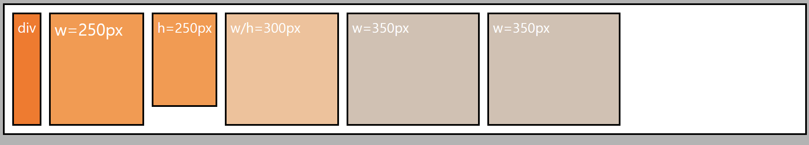  
  
가장 먼저 눈에 뛰는 것은 **모든 요소가 한 행**에 배치된 것이다. 지금까지 봤던 블록 레벨 요소의 전형적인 동작을 따르지 않고 있다.  
또한 세 번째 요소를 제외한 모든 요소가 **부모 요소에서 사용 가능한 전체 높이를 사용**하고 있고  
**이 항목들의 높이는 네 번째 요소를 따라가고 있다.**(높이 300px)  
즉, 다른 요소들이 모두 이 값을 따르고 있다.  
또 달라진 점은 너비를 줄이면 요소의 너비가 콘테츠가 요소 내부에서 필요로 하는 최소한의 공간을 넘지 않는 지점까지 줄어들고  
화면 너비를 늘리면 부모 요소의 너비가 증가하고 블록 레벨 요소의 일반적인 동작을 보인다.  
  
display:flex 를 적용하면 **클래스**에도 이러한 상태가 적용된다.  
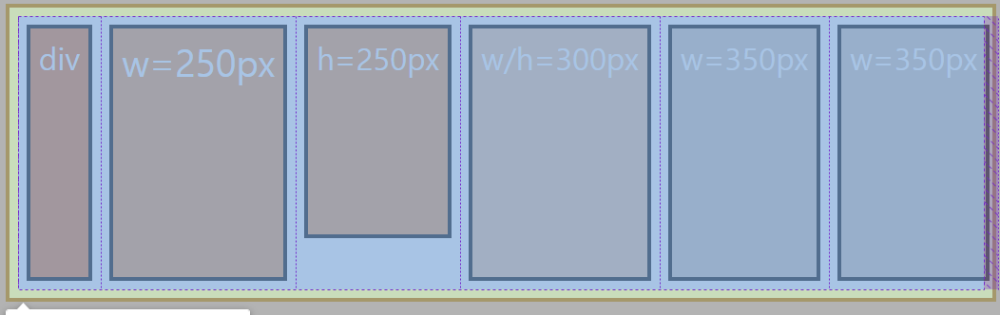  
이 전체가 flex 컨테이너이고 이 컨테이너 안에 든 항목 여섯 개는 모든 flex 항목이 된 것이다.  
부모 요소에 display:flex 를 추가해서 자동으로 발생한 현상이다.  
  
### display: inline-flex
```
.flex-container {
  ...
    display: inline-flex;
  }
```
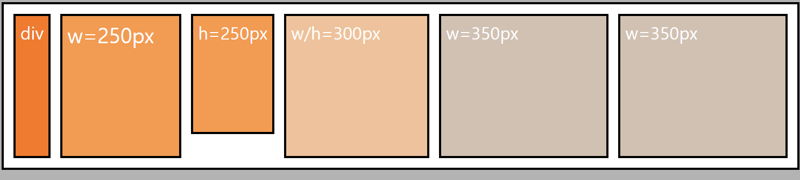  
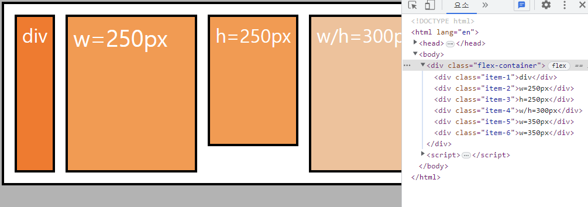  
  
display:flex 선언과 달리 요소들의 크기를 변경할 수 없습니다.  
이제 크기가 정의된 실제 너비에 의해 사전 정의되기 때문입니다.  
따라서 부모 요소의 크기도 더 이상 변경되지 않는 것이다.  
즉, 콘텐츠를 모두 표시하는 데 필요한 공간만을 사용한다. 마치 인라인 요소처럼 작송 하는 셈이다.  
여기서 흥미로운 점은 display:inline-flex 역시 **네 번째 항목에 따라 높이가 결정**된다는 점이다.  
  
## flex-direction(축 방향) & flex-wrap(줄 바꿈)
그렇다면 display:flex 를 적용함으로써 어떤 프로퍼티가 자동으로 적용됐을까??  
두 가지가 자동으로 적용되었는데 그중 첫째는 `flex-direction` 이고 기본 값은 `row(행)` 이다  
두 번째는 `flex-wrap(줄 바꿈)`이고 기본 값은 `nowrap(줄바꿈 없음)` 이다.  
  
### flex-wrap
```
.flex-container {
  ...
    flex-wrap: wrap;
  }
```
flex-wrap 의 기본값인 `nowrap(줄바꿈 없음)`을 `wrap`으로 변경하게 되면 바뀐 부분이 안보인다.  
그런데 창의 크기를 줄여 보면:  
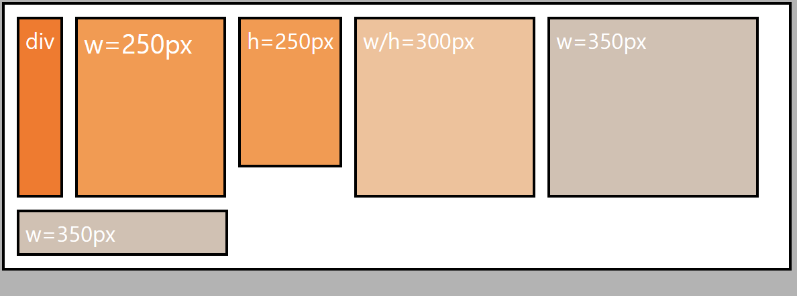  
**요소가 정의된 값 아래로 너비를 줄여야 하는 순간이 오면 두 번째 행으로 내려갑니다.**  
이 경우 너비가 350px인 요소가 내려간 것을 확인할 수 있다.  
또 다른 특이점은 **요소의 높이도 변경됐다는 점이다.**  
그 이유는 첫 번째 행에서는 네 번째 요소에서 정의한 높이에 맞게 조정되어 다른 요소들의 높이가 조정 돼었다.  
두 번째 행으로 내려온 요소는 다르게 작동하게 되는데 이때는 **단순히 콘텐츠를 표시하는데 필요한 높이**만 사용된다.  

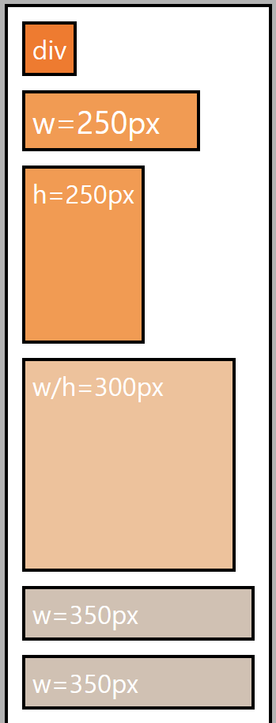  
이렇게 창을 줄이고 줄여 결국에는 이런 식으로 하나의 열로 표시되게 된다.  

```
.flex-container {
  ...
    flex-wrap: wrap-reverse;
  }
```
정의 되었던 순서의 역순이 된것을 확인할 수 있다.  
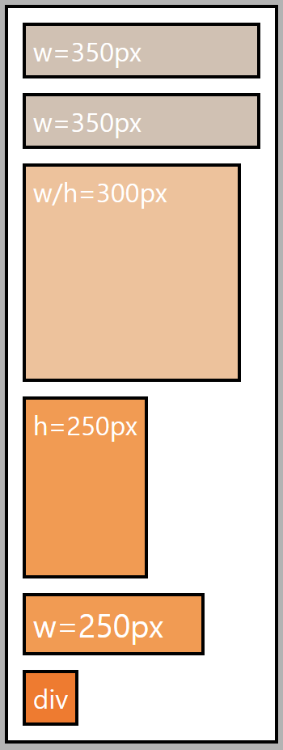  
  
하지만 여기서 잼있는 점은 다시 원래 크기로 되돌리면:
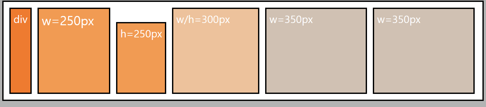  
  
처음에 봤던 동작으로 돌아가게 된다.  
그런데 여기서 중요한 부분은 세 번째 항목의 위치를 보면 위가 아니라 아래를 기존으로 표시 되어 있다.  
즉, 아래를 기준으로 시작해서  250px 높이까지 사용되었다.  
  
> 정리  
> 기본적으로 항목의 줄빠굼 여부와 줄바꿈 방법을 정의하는 프로퍼티
  
### flex-direction
```
.flex-container {
  ...
    flex-direction: column;
  }
```
row(행)를 column(열)으로 변경해보자  
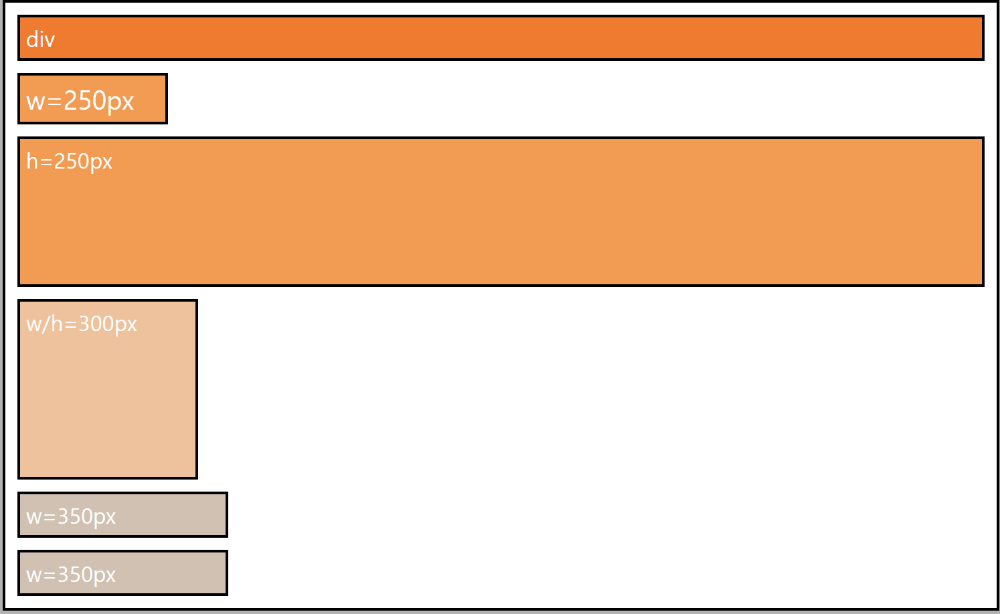  
  
요소들은 이제 블록 레벨 요소가 동작하는 방식대로 동작하고 있다.  
너비가 지정되지 않은 이 div 요소는 사용 가능한 전체 공간을 사용하고 있다. 세 번째 div 요소도 마찬가지이다.  
너비가 지정된 div 요소는 지정된 너비의 끝 지점까지만 표시된다.
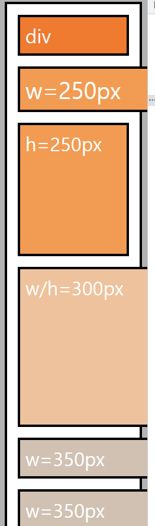  
  
화면의 너비를 확 줄여보니 위의 설명이 조금더 명확하게 이해가 될것이다.  
지정된 값 아래로 내려가면 가려지게 된다. 그런데 예를 들어 정의된 너비가 없는 세 번째 요소의 크기는 창의 너비 맞춰 줄어든다.  
  
```
.flex-container {
  ...
    flex-direction: column-reverse;
  }
```
  
  
flex-wrap 에서 wrap-reverse 와 비슷한 방식으로 작동한다. 항목이 하단에서 상단으로 역순으로 표시된다.  
`column-reverse` 가 있다면 `row-reverse` 또한 존재한다.  
  
## 기본축과 교차축
부모 요소인 flex 컨테이너에 flex-direction(축 방향)을 적용해서 어떤 작업을 수행하는 것일까??  
Main Axis(기본 축) 과 Cross Axis(교차 축)과는 무슨 관계가 있을까??  
  
먼저 flex 컨테이너가 있고 row(행) 값을 가진 flex-direction(축 방향) 프로퍼티를 적용했다.  
이설정은 기본값이고 이때 **기본 축의 시작점은 요소 또는 웹사이트위 왼쪽 상단 모서리**가 됩니다.  
기본 축이 왼쪽 상단에서 오른쪽 상든으로 이동하는 경우 **교차 축은 언제나 기본 축과 동일한 시작점을 공유** 한다.  
즉, **왼쪽 상단에서 왼쪽 하단 모서리**로 이동합니다.
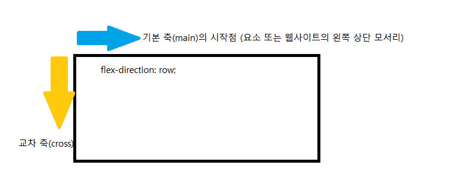  
  
이게 기본적으로 flex items 가 표기되는 기본 동작이다.  
기본 축을 따라 왼쪽에서 오른쪽으로 가로 행에 표시된다.  
그렇다면 `flex-direction : row-reverse` 일때는 기존 기본 축(main)의 기준인 왼쪽 상단에서 오른쪽 상단으로 이동하게 된다.  
역시 교차측 역시 시작 좀을 공유하기 때문에 오른쪽 상단에서 오른쪽 하단 모서리로 이동하게 된다.  
  
  
이 기본축과 교차축은 `flex-direction` 프로퍼티의 값에 어떤 값을 적용하는지에 따라 두 축의 시작점과 끝점이 바뀐다.  
이제 다시 코드로 돌아와서 다시한번 확인해보자  
  
첫번째 flex items 가 왼쪽 상단 모서리에서 시작되는 걸 확인할 수 있다.  
또한 `flex-direction : row` 이기 때문에 왼쪽 에서 오른쪽으로 정렬된 것을 확인할 수 있다.  
이것이 `기본 축`이다.  
화면을 줄이면 flex-wrap(줄 바꿈)이 작동하고 `교차 축`을 따라 위에서 아래로 줄이 바뀐다.  
하지만 첫번째 flex items 은 여전히 왼쪽 상단 모서리에 위치해 있다.  
  
  
> flex-direction : row-reverse  
> row-reverse 는 위에 설명한것과 정확하게 반대로 작동한다.
  
`flex-direction`을 이용해서 **기본 축과 교차 축을 설정할 수 있다는 점**을 반드시 기억해야 한다.  
  
그렇다면 여기서 궁금증이 발생한다.  
과연 `flex-direction: column`일때 기본 축과 교차 축은 어떻게 동작할까??  
`flex-direction:column`일때도 시**작점은 동일**하다. 여전히 왼쪽 상단 모서리 이다.  
그런데 이번에는 **기본 축이 위쪽에서 아래쪽**으로 **교차 축이 왼쪽에서 오른쪽** 방향을 가리키게 된다.
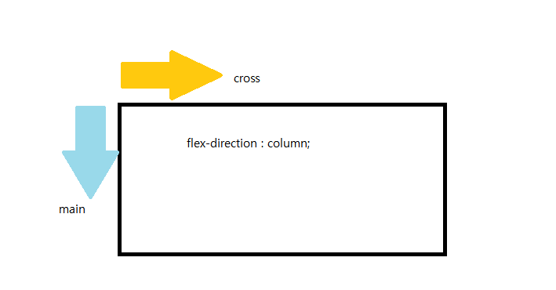  
  
`flex-direction`은 기본 축을 정의합니다. `row`값은 기본 축이 왼쪽에서 오른쪽으로  
`row-reverse`는 오른쪽에서 왼쪽으로 이동한다.  
또는 `flex-direction` 값이 `column`인 경우 기본 축이 왼쪽 위에서 아래로  
`column-reverse`인 경우에는 아래쪽에서 위쪽으로 이동하게 된다.  
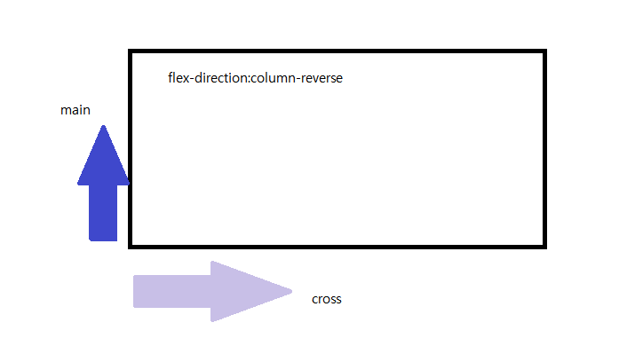  
  
### 정리
`flex-direction: row`인 경우 기본 축의 시작점은 왼쪽 상단 모서리이고 `reverse` 인 경우는 우측 상단 모서리이다.  
`flex-driection:column`인 경우 기본 축의 시작점은 여전히 왼쪽 상단 모서리이지만 방향이 위에서 아래쪽 방향으로 이동하게 된다.  
  
> 높이의 기준  
> 여러 요소의 높이는 높이가 가장 큰 요소에 맞춰 조정된다.
  
## flex-flow(flex-direction 과 flex-wrap의 축약)
```
    /*flex-direction: column;*/
    /*flex-wrap: wrap;*/
    flex-flow: row wrap;
```


## align-items(항목 정렬) & justify-content(행 맞춤) 
### align-items
어떤 프로퍼티를 사용해야 요소의 높이가 항상 정의된 최대 높이를 따르도록 할 수 있을까??  
바로 `align-items` 프로퍼티를 사용하면된다. `align-items`(항목 정렬)의 기본값은 stretch(늘리기)이다.  
값을 `center`로 변경하고 변화를 확인해보자.  
  
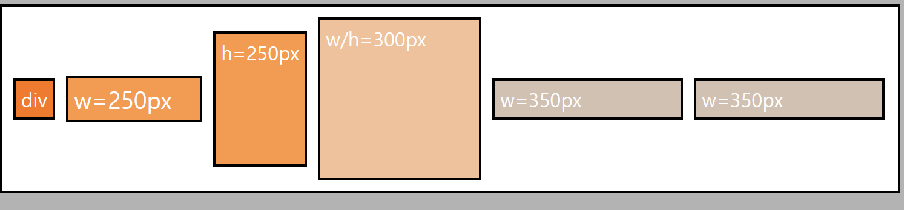  
  
높이가 변경된 것을 확인할 수 있다.  
`align-items`(항목 정렬) 프로퍼티를 사용하면 요소들의 높이가 어떤 영향을 받는 것일까?  
이는 **완전히 잘못된 생각이다**. 바뀐 화면을 보고 그렇게 생각할 수 있겠지만 지금까지 배운 지식을 적영보면  
`flex-direction`을 row 에서 column 으로 변경하면 기본 축도 변경된다고 우리는 알고있다.  
`column`으로 값을 변경하고 확인해 보면  
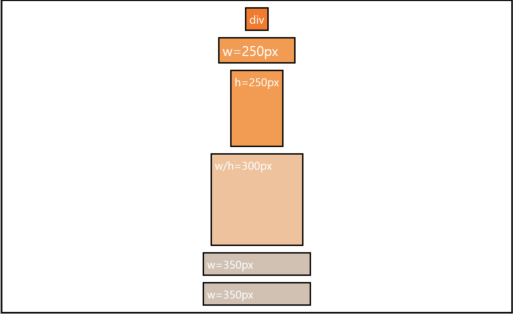  
높이에는 영향을 미치지 않는 것을 확인할 수 있다. **flex items 가 교차 축을 따라 가운데로 정렬**됐을 뿐이다.  
매우 중요한 부분이다. flex-direction(축 방향)을 column(열)로 설정했기 때문에 교차 축이 왼쪽에서 오른쪽으로 이동하고  
따라서 각 항목들이 화면 중앙에 위치하게 되는 것이다. 
  
다시 축방향을 `row`으로 변경하고 확인해보면  
  
항목이 교차 축을 따라 가운데 정렬 된다. 이때 교차 축은 왼쪽 상단에서 왼쪽 하단 모서리로 이동한다.  
  
### 정리
align-items 프로퍼티는 언제나 교차 축을 참조하여 정렬한다.  
* center : flex-items를 교차 축 중앙에 정렬
* flex-start : flex-items를 교차 축의 기준점에 정렬
* flex-end : flex-items를 교차 축의 끝 부분에 정렬
  
### justify-content
기본 축을 참조하여 정렬하는 프로펕티는 무엇일까??  
`justify-content` 프로퍼티를 이용하여 기본 축을 기준으로 flex items를 정렬할 수 있다.  
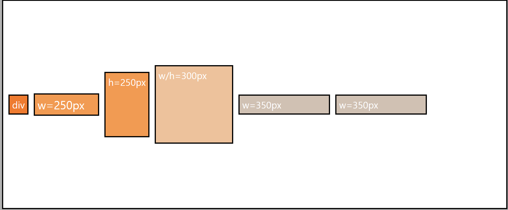  
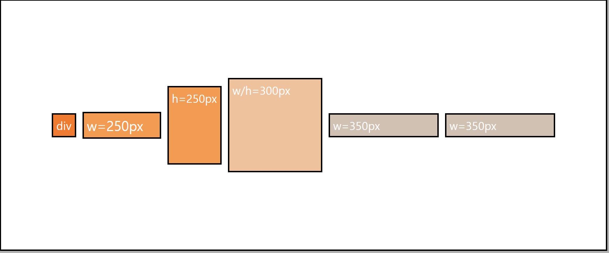  
  
기존에 이미 교차축을 기준으로 flex items를 가운데 정렬 하였고  
`justify-content` 프로퍼티를 이용해 기본 축을 기준으로 가운데 정렬 하였다.  

