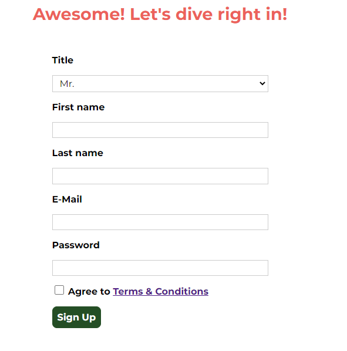

# 폼 추가 및 스타일링
1. input 태그와 button 태그의 스타일링 방법에 대해알아보자  
2. 유효성 검사 스타일 살펴보기
   1. 사용자에게 피드백을 제공
      1. 예를 들어 입력란에 빨간색 테두리가 표시되게 한다 
  
## 고급 속성 선택자 이해
* 속성 선택자
  * [type] { color: red; }
  * 이렇게 하면 `type`속성이 있는 모든 요소를 선택할 수 있습니다.
  * `<input type="text">`
  
속성 선택자를 이용하면 해당 속성을 가진 요소들의 집합을 제한할 수 있다.  
예를 들어 특정 속성 값을 가진 요소만 선택하고 싶다고 할때:  
* 특정 속성값을 선택
  * [type = "email"] { color : red; }
    * type 속성을 그냥 설정하는 게 아니라 그 값이 `email`은 속성을 특정한다.
    * 이렇게 하면 `email` 타입의 모든 `input` 요소가 **선택**됩니다.
    * `<input type="email">`
  
* 목록에서 특정 속성 값을 가진 요소를 선택하고 싶을때
  * [lang~="en-us"] { color : red; }
    * 등호 앞에 물결표(~)는 하나 이상의 값이 있는 속성을 선택하는 역할을 한다.
    * `<p lang="en-us en-gb></p>`
      * lang 속성은 en-us 와 en-gb 라는 속성 값이 있다.
  
* 특정 속성 값 또는 이 속성 값을 접두사로 사용하는 요소를 선택하고 싶을때
  * [lang|="en"] { color : red; }
  * `|`기호는 en 과 같거나 en 으로 시작해야 한다는 의미
  * `<p lang = "en-us"></p>`
  
* 특정 속성 값 접두사를 가진 요소를 선택
  * [href^="#"] { color : red; }
  * `^`기호는 `#`기호로 시작하는 모든 요소를 선택
  * `<a href="#all"></a>`
  
* 접미사로 대상을 선택
  * [href$=".de"] { color: red; }
  * `$`기호는 href 속성이 있는 요소중 .de로 끝나는 모든 요소를 선택
  * `<a href="ab.de"></a>`
  
* 특정 속성 값이 들어있는 요소를 선택
  * [src*="cdn"] { color : red; }
  * `*`기호는 src 속성이 있는 모든 요소가 대상이며 콘테츠의 일부로 cdn을 포함하는 요소를 선택
  * cdn 으로 시작할 수도 cdn으로 끝날수도 있다. 그저 들어가만 있으면 된다.
  * ``
  
* 대소문자 무시
  * [src*="cdn" i] { color: red; }
  * 대괄호를 닫기전에 `i`문자를 추가하면 대소문자를 무시하라는 의미
  * `i`를 추가하지 않으면 대소문자를 구분
  * ``


## outline
`<input type="text">` 요소 일때 해당 요소를 클릭하게되면 테두리의 색이 변경되거나 혹은 짙어진다.    
mac 에 경우는 테두리가 파란색으로 나온다.
  
```
기본적인 CSS가 적용되서 그렇다
: focus {
  outline: -webkit-focus-rising-color auto 5px;
}
```

  
  
그러면 이 outline(외곽선)과 border(테두리)는 뭐가 다를까??  
`outline`은 border과 아주 비슷하지만 몇가지 차이점이 있다.  
예를 들어 둘은 동시에 추가될 수 있는데 그럴때 `outline`은 늘 테두리 바깥에 그려진다.  
박스 크기에 포함되지도 박스 그림자에도 영향을 끼치지 않는다.  
`outline`을 아무리 두껍게 만들어도 박스 그림자에도 변화가 없다.
  
`outline`은 포커스를 뒀을 때 이를 표시하는 좋은 도구지만  
조금은 다른 방법은 스타일링 해보자  
```
.signup-form input:focus,
.signup-form select:focus {
    outline: none;
    background: #d8f3df;
    border-color: #2ddf5c ;
}
```
  
  
## checkbox
먼저 기존에 스타일링 되어있는 `input`중 select 만 제외하고 스타일링을 시작하자
```
.signup-form input:not([type="checkbox"]),
.signup-form select {
    border: 1px solid #cccccc;
    padding: 0.2rem 0.5rem;
    font: inherit;
}
```
`:not` 의사 선택자를 이용해서 제외하자 이때 `()`안에는 제외할 선택자를 인자로 전달해 주면된다.  
```
.signup-form input[type="checkbox"] {
    border: 1px solid #cccccc;
    background: white;
    width: 1rem;
    height: 1rem;
}
```
  
  
확인해보면 박스의 크기가 조금 커지긴했는데 크게 변경된게 없어보인다. 여전히 기본 스타일이다.   
  
하지만 작성한 스타일이 제대로 적용되어 있는것을 확인할 수 있다.  
즉, `select`처럼 체크박스도 특별한 `input` 타입이다.  
`OS`에 따라 checkbox 에 기본 스타일이 적용될 수 있다.  
`-webkit-appearance: checkbox;` 값이 기본값으로 설정되 있는 경우가 있다. 
그래서 해당 기본설정 값을 비활성화 해준다.
```
-webkit-appearance: none;
-moz-appearance: none;
appearance: none;
```  
  

하지만 비활성화 하게 되면 체크박스에 체크가 안되는 상황이 발생한다.  
사실 기술적으로는 체크가 되는 것이지만 클릭했을때 표시가 되지 않는 것이다.  
즉 단순히 체크가 됬는지 안됬는지 눈으로 확인이 불가능한 상태이다.  
```
.signup-form input[type="checkbox"]:checked {
    background: #2ddf5c;
    border: #0e4f1f1f;
}
```
이런식으로 `:checked` 의사 클래스를 사용해서 스타일링 할 수 있다.  
  
  
## 유효성 검사
검증이란, 일반적으로 필수 조건을 설정하는 것이다.  
예를 들어 모든 입력란을 채워야 한다든가 이메일 입력란에 유효한 이메일 주소를 입력해야한다 등 이 있다.  
이 검증을 구현하는 방법은 매우 많지만 실제 구현은 일반적으로 서버에서 검증을 하거나  
Javascript 를 통해서 이루어진다.  
  
이번 에는 사용자가 이해하기 쉬운 피드백을 제공하는 방법을 알아보자  
`특수한 CSS` 클래스를 정의해 유효하지 않은 입력 요소에 부여할 수 있다.  
일단 우리는 만약 유효하지 않다면 `invalid`라는 클래스를 추가해보자  
```
.signup-form input.invalid,
.signup-form select.invalid {
    border-color: red;
    background: #faacac;
}

```
  
  
이런식으로 수동으로 추가하는 방법이 있는 반면에  
HTML 과 CSS에서는 더욱 세련된 스타일 방법을 제공하고 있다.  
`:invalid`라는 특별한 의사 선택자가 존재한다.  
```
.signup-form :invalid{
    border-color: red;
    background: #faacac;
}

```
위 의사 클래스를 적용하고 이메일 입력란을 클릭했다가 다른 곳을 클릭하면  
  
위 처럼 invalid 스타일이 적용되는 것을 확인할 수 있다.  
그 이유는 HTML이나 브라우저가 자동으로 검증을 진행하기 때문이다.  
이메일을 입력하는 요소의 타입이 email 이므로 현재 입력된 t가  
유효하지 않은 이메일 주소임을 감지하고 `invalid`의사 선택자를 적용한 것이다.  
이때 우리가 적용한 border 색상이 적용되지 않는데 이는  
```
.signup-form input:not([type="checkbox"]),
.signup-form select {
    border: 1px solid #cccccc;
    padding: 0.2rem 0.5rem;
    font: inherit;
}
```
`not`문과 not 문 안의 선택자가 우선순위가 높기 때문에 이스타일이 우선 적용된 것이다.  
이 문제를 해결하는 방법으로는 `!important` 라고 하는 인수를 넣어 주는 우선순위를 변경하는 것이다.    
```
.signup-form :invalid{
    border-color: red !important;
    background: #faacac;
}

```
또 다른 해결책으로는 이 not 선택자를 통하는 것이다.
```
.signup-form :invalid,
.signup-form input:not([type="checkbox"]){
    border-color: red ;
    background: #faacac;
}

```

HTML 으로 검증하는 방법은 요소에 `required`라는 속성 값을 추가 하는 것이다.  
이를 추가하게 되면 해당값이 반드시 존재햐아 한다.  
