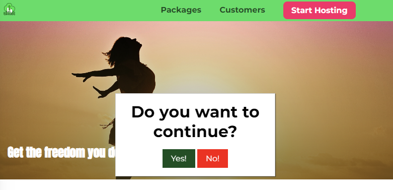
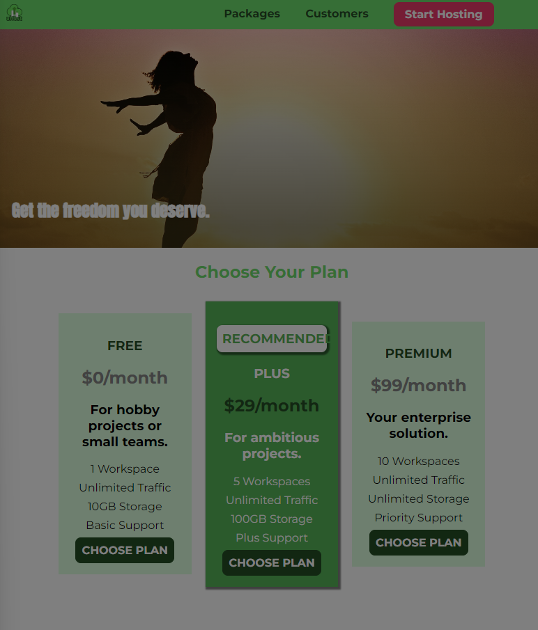

# 자바스크립트와 CSS
## 모달(popup)추가하기
```
    <div class="modal">
        <h1 class="modal__title">Do you want to continue?</h1>
        <div class="modal__actions">
            <a href="start-hosting/index.html" class="modal__action">Yes!</a>
            <button class="modal__action modal__action--negative" type="button">No!</button>
        </div>
    </div>
```
해당 모달창을 추가하고 새로고침을 하면 화면에 아무것도 나타나지 않는다.  
당연히 여기에는 표시하지 않았지만 display 프로퍼티가 `none `이기때문이다. 이는 `.backdrop`을 추가했을 때와 상황이 유사하다.  
따라서 우리는 모달을 보여주기 위해서는 display 프로퍼티 값을 `none`이 아니게 해주어야 한다.
  
  
이렇게 항상 수동으로 `display` 프로퍼티 값을 변경하기에는 매우 비효율적이고 불편하다.  
따라서 우리의 목표는 해당 프로퍼티를 동적으로 바꾸는 것이다.  
이를 위해 `JavaScript`로 요소의 스타일을 변경하는 방법을 이해해야 한다.  
여기서 굳이 `JavaScript`를 사용하는 이유는 `JavaScript`가 유일하게 페이지 로드 후 코드를 실행할 수 있는 도구이기 때문이다.  
  
`JavaScript`는 브라우저의 DOM(Document Object Model)에 접근하여 특정요소의 CSS를 변경,추가,수정이 가능하다.  
`JavaScript` 내용을 다루는 것이 아니기 때문이 간단하게 필요한 부분만 언급하고 넘어간다.  
먼저 특정 요소에 대한 정보를 가지고 오고싶을때는 `document.querySelector`를 사용면된다.  
특정 요소들의 배열을 반환 받고 싶을때는 `document.querySelectorAll`을 사용하면 된다. 
이렇게 해당 DOM API 를 이용해서 특정 요소의 정보에 대한 객체를 가지고 올 수 있고  
해당 객체안에는 요소에대한 스타일 정보도 포함하고 있다.  
```
const backdrop = document.querySelector('.backdrop');
backdrop.style.display = 'block';
``` 
  
우리가 `Choose Plan` 버튼을 클릭했을때 어떤 동작이 작동하기 위해서 우리는 `Event 리스너`를 등록해야한다.  
그래서 우리가 지정한 이벤트가 발생했을때 브라우저는 해당 이벤트를 감지해서 우리가 등록한 콜백함수를 호출해 준다.  
여기서 우리가 요소에 이벤트를 등록할 수 있는 이유는 DOM요소 에서 읽어온 Element 객체의 최상의 부모는 `EventTarget`  
이고 이 `EventTarget`은 3개의 메소드 `addEventListener`,`removeListener`,`dispatchEvent`를 가지고 있기 때문이다.  

  

