# CSS 좀 더 알아보기
기본 HTML
```
<body>
    <main>
        <section id="product-overview">
            <h1>Get the freedom you deserve.</h1>
        </section>
        <section id="plans">
            <h1 class="section-title">Choose Your Plan</h1>
            <p>Make sure you get the most for your money!</p>
        </section>
    </main>
</body>

```
기본 CSS
```
body {
    font-family: 'Montserrat', sans-serif;
}

#product-overview {
    background: #ff1b68;
}

.section-title {
    color: #2ddf5c;
}

#product-overview h1 {
    color: white;
    font-family: 'Anton', sans-serif;
}

/* h1 {
    font-family: sans-serif;
} */
```
## CSS 박스 모델
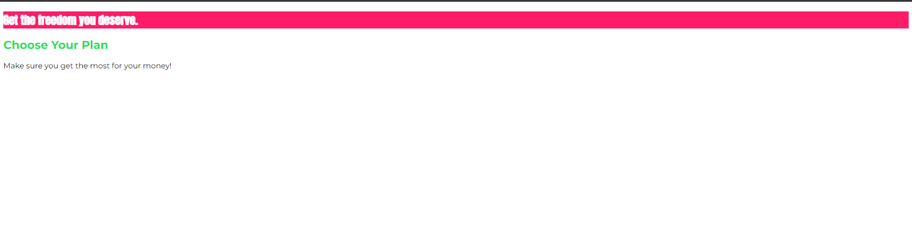  
빨간색 박스가 웹 페이지의 첫 요소이니까 주변 하얀 공백을 없애는 것이 보기 좋아보이고  
크기나 높이를 키운다거나 필요한 요소를 더 추가하거나 공백을 조정할 때에 `박스 모델을` 사용합니다.  
  
모든 HTML의 모든 요소는 CSS 상에서 박스로 인식된다.  
크롬의 개발자 도구에서 어떤 요소를 선택해도 맞찬가지다.
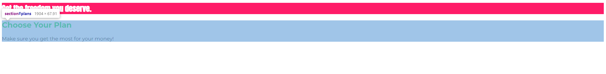  

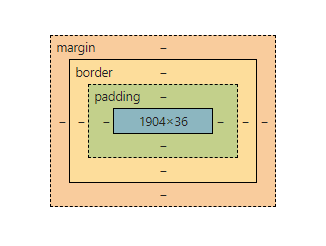  
위의 사진과 같이 CSS는 요소를 이렇게 인식합니다.  
모든 요소에는 콘텐츠가 있는데 사진에서는 푸른색 영역이 이 영역이다.  
우리의 HTML 문서에서 `section` 에서의 콘텐츠는 바로 `h1` 태그 이다.  
`h1` 태그의 콘텐츠 영역은 바로 `텍스트` 가 된다.  

이 콘텐츠 영역이 있고 이를 감싸는 안 쪽 여벽(padding) 이 있습니다. 위의 사진에서는 초록색 부분 이다.  
`section` 영역에 padding 값을 주게 되면  내부 콘탠츠 `h1` 영역과 그다음 영역인 테두리(border) 사이에 내부적으로 공백을 둔다는 의미 입니다.  
  
각 요소에는 테두리(border)를 추가할 수 있다.  
이 테두리(border)는 요소를 감싸고 있으면 안쪽 여백(padding) 바로 다음에 위치해 있다.  
위와 마찬가지로 안쪽 여백(padding)은 콘텐츠 바로 다음에 온다.  
안쪽 여백을 추가하게 되면 그때부터 요소의 콘텐츠는 콘텐츠와 콘텐츠에 대한 모든 여백을 통칭하게 된다.  
즉, 부모의 padding(안쪽 여백)을 추가 함으로써 자식 요소의 margin(바깥쪽 여백)에 추가 됩니다.

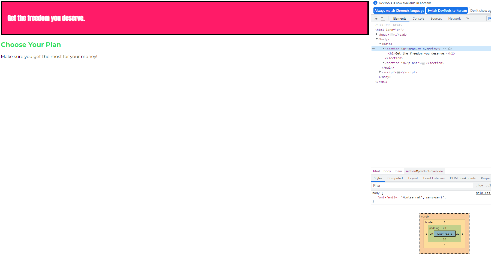

끝으로 요소를 감싸는 여백이 필요할 때면 바깥쪽 여백(margin)을 활용합니다.  
이 바깥쪽 여백(margin)은 다른 위의 요소와 다르게 핵심 요소는 아니지만,  
요소와 다음 형제 사이에 존재하는 거리라고 할 수 있다.  

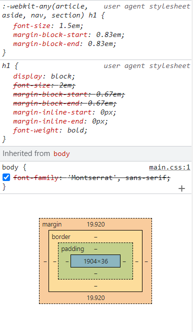  
우리가 선택한 `h1`태그에 별도로 margin 값을 주지않아도 브라우저 기본값인 margin before, margin after가 적용 되어 있다.  
위의 margin은 section 컨테이너 바깥에 있으므로 요소의 일부가 아니다.  
즉, section 콘텐츠 부분이 아니라는 의미이다.
  
## 여백 상쇄(margin collapsing)의 이해 및 여백(margin) 기본값 제거
우리가 별도로 `body` 테그에 margin 값을 설정하지 않아도 브라우저 기본 값이 적용 되어 있다.  
여기서 우리는 margin 값을 조정해서 기본 값을 제거하고 상쇄하는 법에 대해 확인해보자.  
```
body {
    font-family: 'Montserrat', sans-serif;
    margin: 0;
}
```
  
margin 프로퍼티에 0 값을 설정함으로써 body 에 바깥쪽 여백을 제거할 수 있다.  
  
여기서 또 다른 포인트는 형제 관계에 있는 태그들의 margin 값이 서로 겹친다는 것이다.  
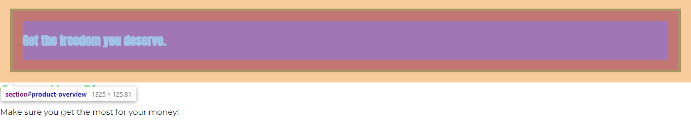  
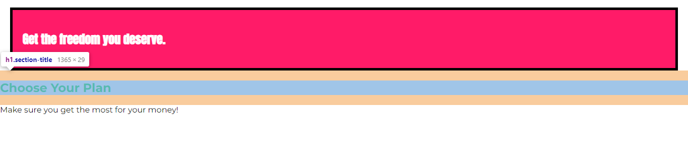  
  
바리 오리헌 현상을 여백 상쇄라고 한다.  
두 margin 값이 존재하는 두가지 요소가 나란히 있다고 가정했을때  
margin 값이 더 큰쪽이 작은쪽을 덮어쓴다(상쇄 시킨다).  
이는 CSS에서 강제로 수행하는 작업이며 이렇게 함으로써 두 요소 간 거리가 너무 멀어지지 않게 유지할 수 있다.  
따라서 이와 같은 경우에는 margin-top, margin-botton을 이용해서 상쇄가 일어나는 일을 막는 것이 좋다. 
  
기본적으로 발생 발생하는 3가지 사례를 확인해보자.  
- 둘 다 바깥쪽 여백을 가진 인접 형제 요소
- margin 값을 가진 첫째 또는 마지막 혹은 유일한 자식 요소를 하나 또는 둘 이상의 가지고 있는 부모 요소
- 콘텐츠, padding, border 높이가 지정되지 않은 요소
  
## 프로퍼티 축약(shorthand Properties)
여러 다른 프로퍼티의 값을 단일 프로퍼티로 결합한 것을 말합니다.  
개별 프로퍼티
```
border-width: 2px
border-style: dash | solid
border-color: orange

margin-top: 5px
margin-right: 10px
margin-bottom: 5px
margin-left: 10px
```
  
축약 프로퍼티
```
border: 2px dashed orange

margin: 5px 10px 5px 10px
  //순서 top right bottom left

margin: 5px 10px
//순서 top & bottom left & right  

margin: 10px
  // top right bottom left 모두 10px
```
  
border 의 같은 경우 축약 프로퍼티의 순서는 상관 없으나 핵심은 바로 개별 프로퍼티와 동일하게 인식된다는 거에 있다.  
축약을 사용하면 코드가 좀 더 간결하고 깔끔해 지는 장점이 있고   
먼저 축약 버전을 정의한다음 필요한 부분 혹은 명시도가 높은 클래스를 통해 개별 프로퍼티를 이용해서 한 부분만을 덮어쓸 수도 있다.  
개발자 도구를 통해 축약 프로퍼티 안에 개별 프로퍼티들을 확인할 수 있다.
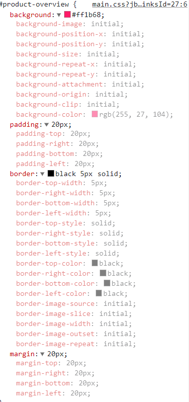  
  
## width 와 height 
우리가 스타일을 줄때 `width`값을 `100%`을 주면 해당 페이지의 전체 너비를 사용하게 됩니다.  
기본적으로 `div`와 `h1`, `section`과 같은 Block 레벨 요소들은 `width`가 `100%`로 기본 설정 되어있다.  
따라서 이런 `block` 레벨 요소에게 100% 값은 크게 유의미한 값은 아니다.
  
이때 페이지 너비의 `100%` 를 사용하던 컨테이너가 `50%` 줄어들면 페이지 너비도 `50%` 줄어든다.  
즉, `body`안에 `main` 태그의 너비가 줄어들때 그 자식인 인`section` 태그의 너비도 반이 될 수 밖에 없다.
  
하지만 `height`는 조금 신기하다.  
```
#product-overview {
    background: #ff1b68;
    width: 700px;
    height: 100%;
}
```  
이런식으로 `section` 요소의 `height`를 `100%`로 설정하면 전체 페이지 만큼 길어지는 걸 기대했지만 높이의 변화는 크지 않다.  
이는 `h1` 요소의 margin 만큼 길이가 길어졌다.  
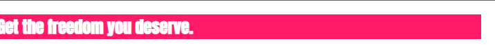  

그 이유는 `height:100%`라고 하면 부모 컨테이너의 가용 높이 만큼 그 길이가 길어진다.  
따러서 `main` 컨테이너로 커서를 옮기면 파란색 영역이 현재 우리가 사용하는 범위임을 알 수 있다.    
하지만 `main` 요소는 내부 콘텐츠에 따라 크기가 동적으로 산출된다.  
만약 `section` 요소가 100% 일때 이 크기를 키우고 싶다면 부모 요소의 height 값을 변경하면 된다.  
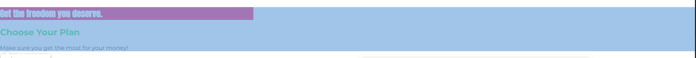  
  
## Box-sizing(박스 크기 조정) 이해
Height 와 Width 그 둘을 통해서 박스의 높이와 너비를 바꿀 수 있다.  
근데 이때 바뀌었다는 것이 정확히 뭘까??  
height 와 width를 성정한 대상이 `콘텐츠` 영역인가? 아니면 `padding` ,`border`, `margin`  
정확히 어느 영역까지 영향을 미치는 걸까??  
```
#product-overview {
    background: #ff1b68;
    width: 100%;
    height: 528px;
    padding: 10px;
    border: 5px solid black;
    margin: 10px;
}
```
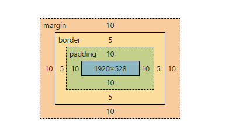  
콘텐츠의 높이는 우리가 설정한 528px로 나와있다. width 역시 100% 이다.  
단, 이때 `padding`, `border`, `margin` 이 추가 되었고  
이로 인해 실제 너비와 높이가 지정한 값보다 더 커지는 상황이 발생한 거다.  
실제 `section` 요소의 너비는 `1950px`이고 높이는 `558px`로 표기된다.  
이는 콘텐츠 영역에서 `padding`, `border`, `margin` 의 너비와 높이를 더하면 나온다.  
  
따라서, 콘텐츠의 높이(height)와 너비(width)를 지정할때 padding 과 margin, border의 값은 산출 되지 않는다.
하지만 이 모든 수치가 더해진 값이 브라우저에서 표시되고 결국 요소가 우리가 원하는 위치에 위치하지 않는 원인이 된다. 

이를 `content-box`라는 개념이고 모든 요소에 기본적으로 너비와 높이를 산출하는 특정 방법이 내재 되어 있음을 뜻한다.  
이는 우리가 `box-sizing` 프로퍼티를 추가함으로써 이 너비 높이 산출 방법을 설정할 수 있고  
기본으로 `box-sizing`프로퍼티에 `content-box`값이 할당되어있다.  
이값을 `border-box`로 변경하면 너비와 높이 값이 padding 과  border 값을 포함하여 설정 된다.(margin 값은 제외)  
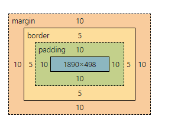  
  
이렇게 `border-box`가 유횽하기 때문에 보통 일반적으로 모든 요소의 기본 설정 값을 대체해서 사용한다.  
그래서 `body` 쪽 스타일에 추가해보자  
```
body {
    font-family: 'Montserrat', sans-serif;
    box-sizing: border-box;
    margin: 0;
}
```
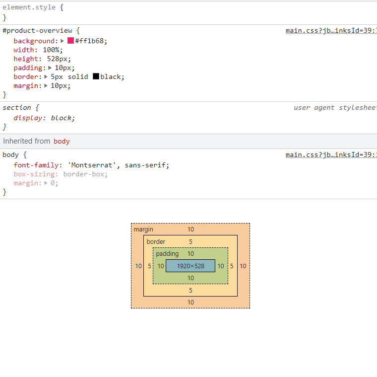  
다시 `content-box` 값으로 변경된 것을 확인할 수 있는데  
이는 box-sizing 설정이 상속되었기 때문이다.  
하지만 스타일에 어딜봐도 `box-sizing`설정을 찾아 볼 수 없다.  
이는 `section` 요소의 기본 값이 `display:block` 이기 때문에 브라우저에서 자체적으로 `box-sizing`을 설정 했기 때문이다.  
  
따라서 위와 같은 경우에는 전체 선택자를 이용해야 한다.  
보통 전체선택자는 모든 요소의 특정 동작을 리셋하고자 할 때 사용한다.
```
* {
    box-sizing: border-box;
}
```
  
## display 프로퍼티 이해
header 추가  
```
<header class="main-header">
    <div>
        <a href="index.html">
            uHost
        </a>
    </div>
    <nav>
        <ul>
            <li class="main-nav__item">
                <a href="packages/index.html">Packages</a>
            </li>
            <li class="main-nav__item">
                <a href="customers/index.html">Customers</a>
            </li>
            <li class="main-nav__item">
                <a href="start-hosting/index.html">Start Hosting</a>
            </li>
        </ul>
    </nav>
</header>
```
  
`display` 프로퍼티를 이용하면 요소의 동작을 바꿀 수 있다.  
예를 들어 블록에서 인라인으로 바꾸거나 인라인 블록을 통해 두 속성 모두 갖게 하거나  
혹은 `DOM`에서 완전히 삭제시킬 수도 있습니다.
  
`HTML` 에는 `inline` 과 `block` 레벨이 존재한다.  
대표적으로 `inline` 에는 `a` 태그를 들 수 있다.  
이는 블록 레벨 처럼 전체 너비를 사용하는 것이 아닌 해당 콘텐츠에 필요한 영역 만큼을 차지한다.  
`block` 레벨은 전체 너비를 사용한다.  
둘 모두 박스 모델을 사용하지만 `inline` 레벨은 margin(바깥 여백)값 설정이 불가능하다.  
왜냐하면 margin 값을 설정해 두면 다른 요소와 줄이 겹칠 우려가 있기 때문이다.  

  
기본적으로 `a` 태그는 `inline` 이지만 `display` 프로퍼티를 통해 `block`레벨로 변경 하였다.  
`block` 레벨은 너비 전체를 사용하기때문에 첫번째 Customers `a` 태그와 같은 레벨에 있을 수 없기 때문에 한줄 내려간 모습을 확인할 수 있다.  

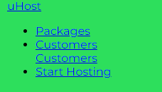  
  
또한 `display : none` 을 통해서 화면에서 삭제할 수 있다.  
이는 안보이는 것이 아니라 실제 문서 대열 자체에서 없어진 것이다.  
하지만 `display:none` 으로 설정된 요소라도 여전히 `DOM`의 일부긴 합니다.  
  
정리
- display
  - inline : 콘텐츠 크기만큼 차지
  - block : 너비 전체 사용
  - none : 화면에서 삭제(안보이게 함)
  - inline-block: 이라인 요소처럼 각 요소가 나란히 위치하게 되지만 블록 레벨 요소처럼 margin(바깥 쪽여백) 및 padding(안쪽 여백)을 설정할 수 있다.
  
`inline-block` 설정을 통해 한줄로 표시하고 박스의 여백등을 설정할 수 있다.  
  
### display:none 과 visibility:hidden 의 차이  
먼저 `display:none`은 문서에서 요소를 제거합니다.  
이는 요소가 보이지 않게 됨을 의미하고 해당 위치를 차단하지 않습니다.  
즉, 다른 요소들이 해당 공간을 차지할 수 있습니다.  
  
하지만, `visibility:hidden`의 경우에는 요소를 숨기지만 해당 공간은 유지합니다.  
둘 모두 가시성에서는 사라지지만 실제 `DOM`에서 제거되지 않기때문에 `Javascript`를 통해서 접근할 수 있습니다. 
  
## inline-block의 동작 이해
```
.main-header > div {
    display: inline-block;
}
.main-nav {
    display: inline-block;
    text-align: right;
    width: calc(100% - 49px);
}
.main-nav__item {
    margin: 0;
    padding: 0;
    list-style: none;
    display: inline-block;
}

<header class="main-header">
    <div>
        <a href="index.html">
            uHost
        </a>
    </div>
    <nav class="main-nav">
        <ul>
            <li class="main-nav__item">
                <a href="packages/index.html">Packages</a>
            </li>
            <li class="main-nav__item">
                <a href="customers/index.html">Customers</a>
                <a href="customers/index.html">Customers</a>
            </li>
            <li class="main-nav__item">
                <a href="start-hosting/index.html">Start Hosting</a>
            </li>
        </ul>
    </nav>
</header>

```
  
위의 그림처럼 `nav` 태그 width 값을 `100%` 에서 `div`태그의 width 값만큼 뺀 값을 설정해도  
여전히 한줄에 위치하는 것이 아니라 그 다음줄에 위치하는 것을 확인할 수 있다.  
이렇게 배치되는 원인은 무엇일까???  
그 이유는 `display:inline-block`과 관련있다.  
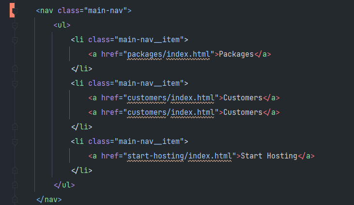  
보통 편집기를 이용한 위와 같이 자동적으로 가시성을 위해 앞족에 공백을 두어 보기 편하게 정렬해준다.  
이게 일반적으로는 문제를 일으키지 않는다.  
`그러나 실제로 이 빈 공백은 문자로 간주되어 추가 인라인 요소로 추가된다.`  
따라서 특정 빼려고 하는 `width`값은 인라인 요소의 `width`값과 그 공백의 너비도 같이 포함되어야 한다.  
따라서 편집기에서 공백을 제거해 준다면  
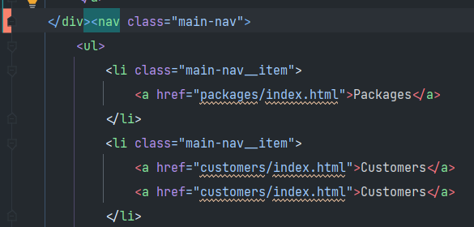
  
이런식으로 한줄에 요소가 위치하는 것을 볼 수 있다.  
하지만 딱봐도 보기에 좋은 방법은 아니다.  
추후에 좀 더 깔끔한 방법을 배워보자.