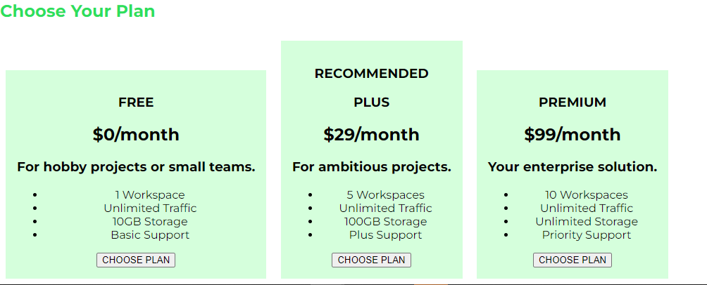

# Practice CSS
```
<section id="plans">
            <h1 class="section-title">Choose Your Plan</h1>
            <div>
                <article class="plan">
                    <h1>FREE</h1>
                    <h2>$0/month</h2>
                    <h3>For hobby projects or small teams.</h3>
                    <ul>
                        <li>1 Workspace</li>
                        <li>Unlimited Traffic</li>
                        <li>10GB Storage</li>
                        <li>Basic Support</li>
                    </ul>
                    <div>
                        <button>CHOOSE PLAN</button>
                    </div>
                </article>
                <article class="plan plan--highlighted">
                    <h1 class="plan__annotation">RECOMMENDED</h1>
                    <h1>PLUS</h1>
                    <h2>$29/month</h2>
                    <h3>For ambitious projects.</h3>
                    <ul>
                        <li>5 Workspaces</li>
                        <li>Unlimited Traffic</li>
                        <li>100GB Storage</li>
                        <li>Plus Support</li>
                    </ul>
                    <div>
                        <button>CHOOSE PLAN</button>
                    </div>
                </article>
                <article class="plan">
                    <h1>PREMIUM</h1>
                    <h2>$99/month</h2>
                    <h3>Your enterprise solution.</h3>
                    <ul>
                        <li>10 Workspaces</li>
                        <li>Unlimited Traffic</li>
                        <li>Unlimited Storage</li>
                        <li>Priority Support</li>
                    </ul>
                    <div>
                        <button>CHOOSE PLAN</button>
                    </div>
                </article>
            </div>
        </section>
```
위의 해당 HTML을 이제 CSS 작업을 시작할 것이다.  
먼저  
```
.plan {
    background: #d5ffdc;
    text-align: center;
    padding: 16px;
    margin: 8px;
    display: inline-block;
    width: 30%;
    vertical-align: middle;
}
```
### 기본 CSS 추가
`text-alin` 프로퍼티에 `center`라는 값을 주면 모든 인라인 요소  
즉, 박스 안의 모든 텍스트를 한가운데로 정렬할 수 있다.  
`padding`을 설정함으로써 border 영역과 콘텐트 영역 사이에 여백을 좀 주고  
`margin`을 통해서 요소들 끼리 너무 붙어 보이지 않게 바깥쪽 여백을 설정합니다.  
마지막으로 `.plan` 클래스를 한줄에 보고싶기 때문에 `display:inline-block`으로 스타일링 한다.  
  
  
`display:inline-block`이기 때문에 콘텐츠 영역에 맞게 width 가 설정되지만  
너무 넓어질 수 있으니 `width`의 값을 `30%`로 제한한다.  
  
자세히 살펴보자면 현재 `id="plans"`의 너비는 별도의 스타일이 없기때문에  
`main` 과 마찬가지로 최대 너비를 가질 수 있을 것이고 우리가 스타일을 지정한 `.plan`은 `div`로 묶여있어서  
기본 값으로 최대 너비를 가진다.  
따라서 `article.plan`의 `width:30%`를 주면 상위 요소에 아무 제약도 설정하지 않았기에 `페이지 전체의 30%` 너비를 얻을 수 있다.  
  
하지만 현재 상태에서는 화면이 너무 작거나 크면 CSS가 조금 이상해진다.  
이는 추후에 반응형 디자인 파트에서 좀더 자세히 다룰 것이다.


### 특정 요금제 강조
기존 HTML 에서 강조하고 싶은 부분에 새로운 CSS 를 추가했다.  
```
<article class="plan plan--highlighted">
<h1 class="plan__annotation">RECOMMENDED</h1>
```
```
.plan {
    background: #d5ffdc;
    text-align: center;
    padding: 16px;
    margin: 8px;
    display: inline-block;
    width: 30%;
    vertical-align: middle;
}
.plan--highlighted {
    background: #19b84c;
    color: white;
    box-shadow: 2px 2px 2px 2px rgba(0,0,0,0.5);
}
```
  
이렇게 기존에 이미 `plan`에서 `plan--highlighted`CSS를 추가하고 만약 같은 부분의 스타일을 수정한다면  
문서상 더 늦게 정의된 것으로 덮어쓴다.  
따라서 `plan--highlighted` 의 `background` 프로퍼티의 값이 적용된다.  
  
아직 배우진 않았지만 `box-shadow` 프로퍼티를 추가하여 그림자를 만들어 볼것이다.  
첫번쨰 키워드로 `inset`을 넣으면 안쪽에 그림자 효과를 주고 그다음으로 그림자가 위차할 `x,y`값을 설정해주면 된다.  
이때 설정된 `x, y`값은 박스의 우측 아래쪽을 기준으로 2px 떨어진 곳에 그림자가 생성된다.  
그다음으로 그림자의 흐릿함 정도와 확산 정도, 색을 지정할 수 있다.    
[MDN box-shadow](https://developer.mozilla.org/ko/docs/Web/CSS/box-shadow),[box-shadow generator](https://cssgenerator.org/box-shadow-css-generator.html)  
  
### rgb(), rgba()
지금 까지 색을 지정할 때 단어(red)나 해시태그(#19b84c)를 썼다.  
사실 다른 방법도 많은데 그중하나가 컬러 함수를 사용하는 방법이다.  
`rgb()` 함수를 통해 red, green, blue 값을 0_255까지 숫자를 이용해서 사용할 수 있다.  
예를 들어 rgb(255,255,255) 이런식으로 사용한다.  
또다른 함수로 `rgba`가 있는데 `rgba`는 마지막 인자로 색의 투명도를 지정할 수 있다.  
  
## 버튼 스타일링
브라우저가 할당한 기본 버튼 스타일을 바꾸려면 버튼 태그 선택자를 이용해야 한다.  
하지만 한 페이지에 버튼이 여러개 존재할 수도 있고 모든 버튼에 똑같은 스타일을 적용할 필요는 없기에  
여기에 기본 버튼 스타일 클래스를 추가한다.  
그 이유는 만약 페이제이 다른 버튼의 스타일을 추가하고 싶다면 굳이 해당 클래스를 추가하지 않아되고(충동 가능성 고료x)  
다른 클래스를 추가하여 스타일 작업을 할 수도 있다.  

```
.button {
    background : #0e4f1f;
    color: white;
}
```
  
  
이렇게 우리가 적용한 스타일이 버튼에 제대로 적용되어 있는 것처럼 보이지만  
기본적으로 적영되는 다른 기본값들이 보입니다.  
  
  

따라서 페이지 내 다른 텍스트와 버튼 콘텐트에 있는 텍스트가 서로 달라 보였던 이유이다.
그래서 우리가 설정한 `font-family`로 변경해 볼 것이다.  
```
.button {
    background : #0e4f1f;
    color: white;
    font: inherit;
}
```  
이때 `font` 포로퍼티를 사용하는 이유는 `font-family`프로퍼티를 이용하면 덮어쓴 `font`값 또한 삭제되기 때문이다.  
따라서 `font` 축약 프로퍼티를 사용해서 그값 으로 `inherit`를 주면 상속에 대한 명시도를 높여 준다.  
그래서 브라우저 기본값보다 상속에 대한 명시도가 우선시 된다.  
  
  
### outline
`outline` 프로퍼티는 `border`과 비슷하지만 박스 모델에 속하지 않는다.  
`border`는 박스 모델의 부분이지만 `outline`은 아니라는 점을 명심해야 한다.  
즉, `outline`은 `border`과 유사한 것으로 박스의 외부에 적용된다.  
`margin`  과 `border`사이에 있으며 `border`의 가벼운 버전이라 생각하면 된다.  
  
### margin: auto;
  
어떤 요소들을 중앙에 정렬하고 싶을때 한가지 방법중 하나가 `margin` 프로퍼티를 이용하는 것이다.  
`margin`요소는 왼쪽에서 또는 오른쪽에서 설정할 수 있는데  
중앙 정렬하려면 그 값을 어마나 설정해야 할까??  
`margin:0 auto` 또는 `margin: auto`로 설정하면 된다.  
`auto`는 자동으로 사용 가능한 공간의 왼쪽과 오른쪽을 균드앟게 맞춰 요소의 수평 중심을 맞춰준다.  
단, 수직으로는 맞추지 않는다.  
  
  
## footer 추가
footer 역시 다른 앱이나 다른 페이지에서 다르게 사용할 수 있기 때문에  
태그 선택자에 스타일을 적용하기 보다는 `class` 를 추가하는 방식이 더 효율적이다.
```
<footer class="main-footer">
    <nav>
        <ul class="main-footer__links">
            <li class="main-footer__link">
                <a href="#">Support</a>
            </li>
            <li class="main-footer__link">
                <a href="#">Terms of Use</a>
            </li>
        </ul>
    </nav>
</footer>

.main-footer {
    background: black;
    color: white;
}
```  
  
먼저 적용된 스타일을 확인해보면 `ul`태그에서 margin 값이 상 하로 존재하는 것이 보이고  
우리가 지정한 font 색상이 white 값이 적용되지 않은 것을 확인할 수 있다.  
그이유는 우리의 `font` 프로퍼티를 상속 받지만 상속 받은 `class`값보다  
브라우저에서 기본적으로 제공하는 스타일의 명시도가 더 높기 때문에 그렇다.  
  
따라서 적용되지 않는 color 프로퍼티를 제거하고 스타일작업을 진행해준다.  
```
.main-footer {
    background: black;
    padding: 32px;
    margin-top: 32px;
}
```

## 새로운 스타일 참조하기
```
    <link rel="stylesheet" href="share.css">
    <link rel="stylesheet" href="main.css">
```

공통 css를 먼저 선언하고 그 뒤에 `main.css`을 선언하였다.  
그 이유는 공통적인 부분의 스타일링이 진행되고  
일반적인 스타일을 뒤에 선언함으로써 기존 스타일을 덮어쓸 수 있기 때문이다.  
  
따라서 임포는 하는 순서가 중요하다.  
위에 있는게 먼저 임포트 및 파싱 되며 아래 있는 파일이 두번재로 파싱된다.  
즉, `share.css` 파일의 스타일을 덮어쓰려면 덮어쓸 파일을 두 번째로 임포트해야 한다.  
  
## CSS float 프로퍼티
과거에는 레이아웃 페이지에 자주 사용했지만 float로 인해 생기는 문제가 많아서 요즘에는 사용하지않는다.  
대신 요즘에는 `Flexbox`를 많이 사용한다.  
하지만 가끔 문서 대열에서 각 요소를 다르게 배치한다는 점에서 유용할 수도 있다.  
  
일단 `float`이란 기본 배치를 재설정한다는 것이다.  
브라우저가 페이지의 오른쪽이나 왼쪽으로 요소를 옮기게 한다.  
적용전
  
적용후  
```
#free {
    background: rgba(234, 252, 237, 0.95);
    float: right;
}
```
  
위에 사진을 보면 이제 문서 대열에 벗어난다는 의미가 무엇인지 알 수 있다.  
보다시피 이건 올바른 방법이 전혀 아니다.  
`float`의 원리는 이미지를 텍스트 안에 배치할 땐 유용하겠지만  
`block-level` 요소를 배치할 땐 좋은 방법이 아니다.  
텍스트는 이 `float`의 원리에 따라 배치되지만 다른 `block-level`요소들은 그렇지 않다.  
그래서 위와 같은 레이아웃이 나타난 것이다.  
  
우리가 원하는 것은 `프리 요금제가 차지하던 공간을 그대로 유지`하고 싶은 것이다  
즉, 다른 `block-level` 요소가 `float`프로퍼티의 영향을 받지 않고 이어지게 해야한다.  
그러기 위해서는 배치하려는 요소 뒤에 헬퍼인 `div` 태그를 추가하면된다.  
```
    <section class="package" id="free">
        <a href="#">
            <h1 class="package__title">Our FREE Plan</h1>
            <h2 class="package__sub">An extremely solid start into our hosting world.</h2>
            <p class="package__description">Get started immediately at zero cost!</p>
        </a>
    </section>
    <div class="clearfix"></div>
```
```
.clearfix {
    clear: both;
}
```
여기서 `clear`프로퍼티는 `float` 프로퍼티를 해제하는 프로퍼티로써  
해당 값으로 `both`는 여기서 할당할 수 있는 `left`와 `right`인 두영역에서 프로퍼티가 해제된다.  
  