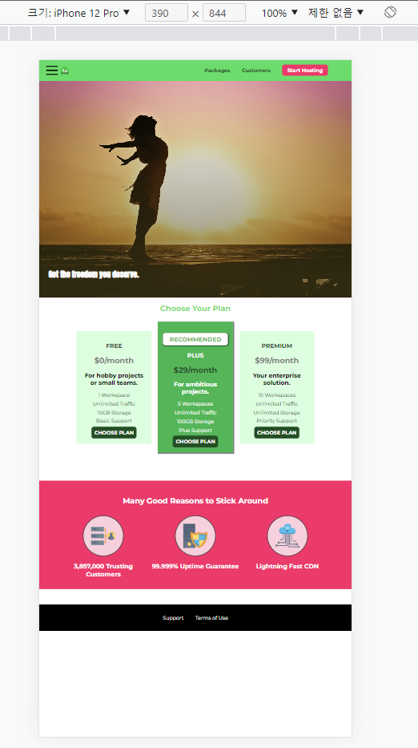
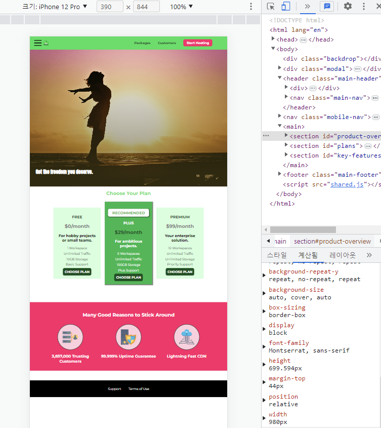
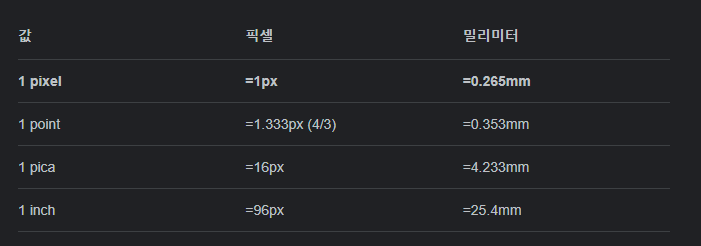
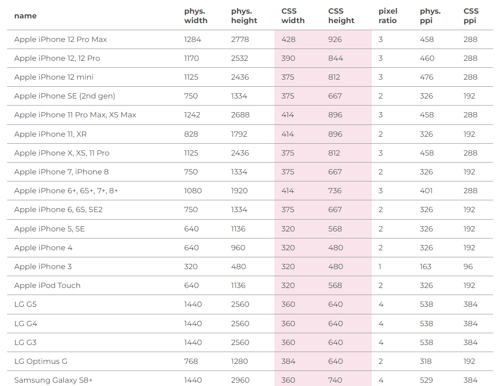
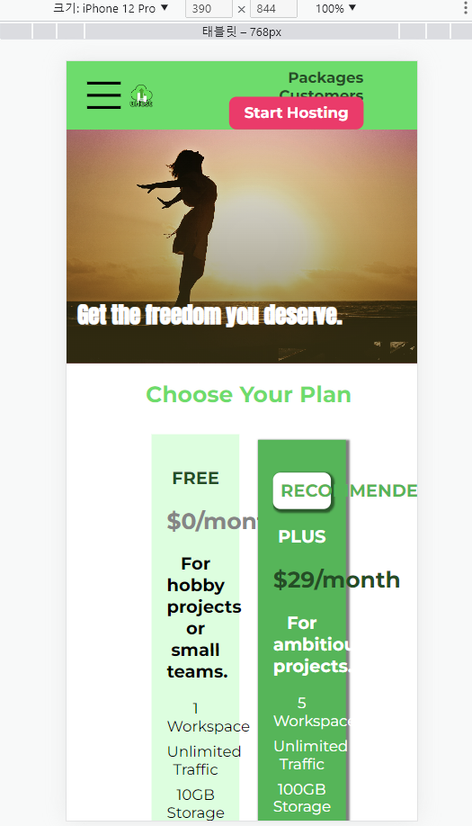

#반응형 디자인
이전 과정들은 모두 데스크톱 버전에만 집중하는 것이 문제 였다.  
최근에는 대부분으 ㅣ사용자가 모바일 기기로 웹사이트를 방문한다.  
그러므로 웹사이트가 모바일 기기와 데스크톱 기기 모두에서 정상적으로 보여지는 것이 매우 중요하다.  
이를 위해서는 반응형 디자인을 구현해야만 한다.  
  
## 하드웨어 픽셀 vs 소프트웨어 픽셀
개발자 도구의 크기를 변경해서 웹사이트의 너비를 줄였을 때 페이지가 부분적으로 반응했다.  
완벽하지 않아도 반응하고 있고 브라우저에서 가용 너비가 줄어들었다는 것을 이해한 것이다.  
하지만 브라우저가 데스크톱 과 모바일 기기의 차이는 인식하지 못한다는 문제가 있다.  
이는 개발자 도구에서 모바일 모양 버튼을 눌러 특정 기기의 환경에서 우리의 웹사이트가 어떻게 보여질지 확인할 수 있다.  
  
근데 우리가 데스크톱에서 화면을 강제로 작게 만들었을때와 달리  
모바일 디자인에서는 위에 사진처럼 디자인이 깨지는 현상이 일어나지 않는다.
  
  
모바일 기기가 데스크톱 기기보다 작음에도 불구하고 디자인이 깨지지 않는 이유는  
브라우저가 전체 웹사이트를 모바일 폰에 밀어넣기 때문에 반응형 디자인이 보이지 않는 것이다.  
왜 이런현상이 발생할까??  
  
먼저 핸드폰 크기를 나타내는 `390 x 844` 너비 와 높이 픽셀을 확인할 수 있다.  
  
근데 여기서 특정 태그의 너비값을 확인해 보면 핸드폰 크기보다 큰 `980px`값을 가진다.  
딱 봐도 뭔가가 제대로 작동하지 않고 있습니다.  

  
브라우저는 모바일기기가 기본적으로 갖는 하드웨어 픽셀을 식별합니다.  
그리고 해당 픽셀 값을 위와 같은 논리를 기반으로 변환한다.  
이 과정이 모니터나 데스크톱 기기에서는 완벽하게 작동하지만 모바일 폰의 경우에는 웹사이트가 이런 식으로 너무 작게  
표시되는 결과가 발생한다. 이런 문제를 일으키는 원인은 현대 모바일 폰의 `픽셀 밀도`가 매우 높기 때문이다.  
즉, 이렇게 높은 픽셀 밀도는 좁은 공간에 들어가는 필셀의 양이 많으면 약간의 문제가 발생한다.
  
픽셀을 인치로 변환하여 기기에 표시할 정보의 양을 지정하는 방법이 더 이상 정상적으로 작동하지 않게 된다.  
픽셀을 인치로 변활할 때 픽셀은 너무 많은데 기기가 너무 작아 가용 공간이 충분하지 않은 경우  
기기의 크기를 늘리는 것은 어렵기때문에 픽셀의 양을 줄이는 방식을 채택한다.  
픽셀의 양이 적으면 디스플레이에 표시할 정보의 양도 줄어들기 때문이다.  
그러면 폰트 크기도 커지고 웹사이트 전체 콘텐츠의 크기도 커질 것이다.  

  
[mydivice.io](https://www.mydevice.io/#compare-devices)  
해당 사이트에 들어가면 기기별 정보를 알 수 있다.  
1. 물리적 크기 
2. CSS 크기  
3. 픽셀 비율(해당 비율로 실제 크기를 나누면 CSS 크기가 나옴)
   1. 예를 들어 CSS는 Iphone 8 의 높이를 667픽셀로 가정합니다. 이때 위의 실제 길이 계산 공식을 확인해보면 96px 이 1인치이고
이때 브라우저가 가정하는 iphone의 높이는 대략 6인치가 되는데 이는 실제 기기의 높이에 가까운 숫자이다.
  
그러면 우리는 어떻게 하면 브라우저가 해당 픽셀 비율을 적용해서 실제 하드웨어 픽셀값으로 변환하게 만들 수 있을까??  
그 해답으로 `뷰포트 메타 태그`를 추가하면 된다.  
`<meta name="viewport" content="width=device-width, initial-scale=1.0">`  
그러면 브라우저가 이 스마트폰의 실제 기기 너비를 식별할 수 있게 됐기 때문에 이는 하드웨어 픽셀이 아닌  
CSS 픽셀(소프트웨어 픽셀)을 고려한다는 뜻이다.  
  
  
## 뷰포트 메타 태그와 CSS 미디어 쿼리
반응형 디자인에 어떤 도구를 추가해야 할까???  
방금 위에서는 `뷰포트 메타 태그`에 대해 알아봤다.  
또 하나가 `미디어 쿼리` 이다.  
  
지금부터 두 개념의 차이와 반응형 웹사이트 생성에 두 가지 모두 필요한 이유를 알아볼 것이다.  
* 뷰포트
  * 기기 뷰포트에 맞게 웹사이트를 조정
    * 만약 실제 픽셀만 지정한다면 모바일 기기에선 웹사이트를 정확하고 편리하게 보여 줄 수 없을 것이다
    * 특정 픽셀 비율이 자동으로 적용되어 하드웨어 픽셀을 소프트웨어 픽셀(CSS 픽셀)로 변환할 수 있다.
  * 뷰포트 메타 태그는 디자인을 변경할 수 없다.
  
* 미디어 쿼리
  * 크기에 따라 디자인을 변경할 수 있다.
    * 즉, 다양한 화면 크기에 맞게 웹사이트의 디스플레이 방식을 지정할 수 있다.
    * 너비에 맞게 특정 규칙을 지정할 수 있다는 의미
  * 개발자 스스로 변경 사항을 지정할 수 있다.
    * 다양한 기기에 맞는 고유한 디자인을 직접 지정할 수 있다.

