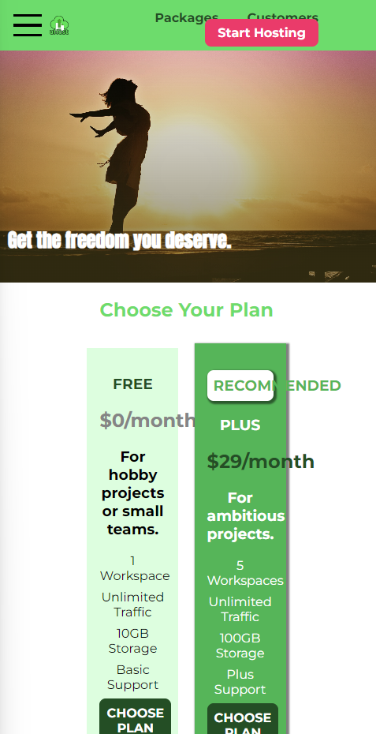

#반응형 디자인
이전 과정들은 모두 데스크톱 버전에만 집중하는 것이 문제 였다.  
최근에는 대부분으 ㅣ사용자가 모바일 기기로 웹사이트를 방문한다.  
그러므로 웹사이트가 모바일 기기와 데스크톱 기기 모두에서 정상적으로 보여지는 것이 매우 중요하다.  
이를 위해서는 반응형 디자인을 구현해야만 한다.  
  
## 하드웨어 픽셀 vs 소프트웨어 픽셀
개발자 도구의 크기를 변경해서 웹사이트의 너비를 줄였을 때 페이지가 부분적으로 반응했다.  
완벽하지 않아도 반응하고 있고 브라우저에서 가용 너비가 줄어들었다는 것을 이해한 것이다.  
하지만 브라우저가 데스크톱 과 모바일 기기의 차이는 인식하지 못한다는 문제가 있다.  
이는 개발자 도구에서 모바일 모양 버튼을 눌러 특정 기기의 환경에서 우리의 웹사이트가 어떻게 보여질지 확인할 수 있다.  
  
근데 우리가 데스크톱에서 화면을 강제로 작게 만들었을때와 달리  
모바일 디자인에서는 위에 사진처럼 디자인이 깨지는 현상이 일어나지 않는다.
  
  
모바일 기기가 데스크톱 기기보다 작음에도 불구하고 디자인이 깨지지 않는 이유는  
브라우저가 전체 웹사이트를 모바일 폰에 밀어넣기 때문에 반응형 디자인이 보이지 않는 것이다.  
왜 이런현상이 발생할까??  
  
먼저 핸드폰 크기를 나타내는 `390 x 844` 너비 와 높이 픽셀을 확인할 수 있다.  
  
근데 여기서 특정 태그의 너비값을 확인해 보면 핸드폰 크기보다 큰 `980px`값을 가진다.  
딱 봐도 뭔가가 제대로 작동하지 않고 있습니다.  

  
브라우저는 모바일기기가 기본적으로 갖는 하드웨어 픽셀을 식별합니다.  
그리고 해당 픽셀 값을 위와 같은 논리를 기반으로 변환한다.  
이 과정이 모니터나 데스크톱 기기에서는 완벽하게 작동하지만 모바일 폰의 경우에는 웹사이트가 이런 식으로 너무 작게  
표시되는 결과가 발생한다. 이런 문제를 일으키는 원인은 현대 모바일 폰의 `픽셀 밀도`가 매우 높기 때문이다.  
즉, 이렇게 높은 픽셀 밀도는 좁은 공간에 들어가는 필셀의 양이 많으면 약간의 문제가 발생한다.
  
픽셀을 인치로 변환하여 기기에 표시할 정보의 양을 지정하는 방법이 더 이상 정상적으로 작동하지 않게 된다.  
픽셀을 인치로 변활할 때 픽셀은 너무 많은데 기기가 너무 작아 가용 공간이 충분하지 않은 경우  
기기의 크기를 늘리는 것은 어렵기때문에 픽셀의 양을 줄이는 방식을 채택한다.  
픽셀의 양이 적으면 디스플레이에 표시할 정보의 양도 줄어들기 때문이다.  
그러면 폰트 크기도 커지고 웹사이트 전체 콘텐츠의 크기도 커질 것이다.  

  
[mydivice.io](https://www.mydevice.io/#compare-devices)  
해당 사이트에 들어가면 기기별 정보를 알 수 있다.  
1. 물리적 크기 
2. CSS 크기  
3. 픽셀 비율(해당 비율로 실제 크기를 나누면 CSS 크기가 나옴)
   1. 예를 들어 CSS는 Iphone 8 의 높이를 667픽셀로 가정합니다. 이때 위의 실제 길이 계산 공식을 확인해보면 96px 이 1인치이고
이때 브라우저가 가정하는 iphone의 높이는 대략 6인치가 되는데 이는 실제 기기의 높이에 가까운 숫자이다.
  
그러면 우리는 어떻게 하면 브라우저가 해당 픽셀 비율을 적용해서 실제 하드웨어 픽셀값으로 변환하게 만들 수 있을까??  
그 해답으로 `뷰포트 메타 태그`를 추가하면 된다.  
`<meta name="viewport" content="width=device-width, initial-scale=1.0">`  
그러면 브라우저가 이 스마트폰의 실제 기기 너비를 식별할 수 있게 됐기 때문에 이는 하드웨어 픽셀이 아닌  
CSS 픽셀(소프트웨어 픽셀)을 고려한다는 뜻이다.  
  
  
## 뷰포트 메타 태그와 CSS 미디어 쿼리
반응형 디자인에 어떤 도구를 추가해야 할까???  
방금 위에서는 `뷰포트 메타 태그`에 대해 알아봤다.  
또 하나가 `미디어 쿼리` 이다.  
  
지금부터 두 개념의 차이와 반응형 웹사이트 생성에 두 가지 모두 필요한 이유를 알아볼 것이다.  
* 뷰포트
  * 기기 뷰포트에 맞게 웹사이트를 조정
    * 만약 실제 픽셀만 지정한다면 모바일 기기에선 웹사이트를 정확하고 편리하게 보여 줄 수 없을 것이다
    * 특정 픽셀 비율이 자동으로 적용되어 하드웨어 픽셀을 소프트웨어 픽셀(CSS 픽셀)로 변환할 수 있다.
  * 뷰포트 메타 태그는 디자인을 변경할 수 없다.
  
* 미디어 쿼리
  * 크기에 따라 디자인을 변경할 수 있다.
    * 즉, 다양한 화면 크기에 맞게 웹사이트의 디스플레이 방식을 지정할 수 있다.
    * 너비에 맞게 특정 규칙을 지정할 수 있다는 의미
  * 개발자 스스로 변경 사항을 지정할 수 있다.
    * 다양한 기기에 맞는 고유한 디자인을 직접 지정할 수 있다.


## 뷰포트 메타 태그
* meta 태그

* name="viewport" 속성
  * 뷰포트 메타 테그는 웹사이트를 보여 주는 기기의 브라우저 내 영역을(뷰포트를) 대상으로 삼으라고 지시한다.
* content="width=device-width, initial-scale=1.0" (컨텐츠 속성)
  * width=device-width
    * 사용자에게 실제로 보이는 부분인 뷰포트의 페이지 너비를 설정할 수 있다.
  * initial-scale
    * 초기 화면 배율을 줌 레벨로 정의한다. 1.0이면 기본값이므로 줌 기능이 적용되지 않는다.
    * 만약 값을 1.5로 바꾸고 확인해보자
    * 
    * 화면을 줌인 해서 확대할 수 있다 만약 줌 기능을 제한 하고 싶다면 user-scalable=no 값을 추가적으로 주면된다.
    * maximum-scale =2.0
      * 최대 배율은 최대 줌 레벨을 제한한다.
    * minimum-scale=1.0
      * 최소 배율을 설정할 수 있다.

  
  
## 모바일에 최적화된 웹사이트
그동안 만든 웹사이트는 잘못된점이 하나 있는데 지금까지 사용했던 웹사이트 생성 방식은 요즘 흔히 이용하는 최신 방식은 아니다.  
보통 모바일 웹사이트부터 생성한다.  
이 말은 모바일 기기에서 보기 좋은 페이지를 먼저 만드는게 일반적인 요즘 방식이다.  
왜냐하면 요즘엔 사용자 대부분이 모바일 기기를 사용해서 웹사이트에 접속하기 때문에 모바일 환경에 어울리는 웹사이트를 만들어야 한다.  
  
  
## 미디어 쿼리
이제 미디어 쿼리를 이용해서 모바일에 최적화된 웹사이트로 변경해 볼것이다.  
이말은 우리가 작성한 CSS가 모바일에서 보기 좋은 방식으로 작동해야한다는 의미이다.  
일반적으로 모바일 기기는 너비가 640px 이하를 모바일 버진이라고 한다.  
다시 말해 40rem 보다 크거나 같은 다른기기에서도 보기가 좋아야한다.
  
미디어 쿼리는 `@media`로 코드를 작성한다.  
이는 해당 코드가 미디어 쿼리라는 걸 코드에 알릴 수 있다.  
그다음으로 `@media ()` 괄호 안에 `if`문을 지정해야 한다.  
그래서 해당 조건절의 조건에 만족할 경우 우리가 작성한 코드가 실행하도록 하기 위함이다.  
`@media (min-width: 40rem)` 이는 CSS 픽셀 소프트웨어에서 장치 너비가 40rem과 같거나 클때 미디어 쿼리가 작동한다.  
작동한다는 의미는 일반적인 CSS 코드를 작성하면 선택자가 필요하고 해당 조건을 만족할때 변경되는 프로퍼티를 지정할 수 있다.
```
#product-overview h1 {
  color: white;
  font-family: "Anton", sans-serif;
  position: absolute;
  bottom: 5%;
  left: 3%;
  font-size: 1.6rem;
}
@media (min-width: 40rem){
  #product-overview h1 {
    font-size: 3rem;
  }
}
```
  
    
이런식으로 여러 미디어 쿼리를 이용해서 범위를 다양하게 적용한다면  
여러 장치 너비마다 프로퍼티를 지정할 수 있다.

### 유의사항
미디어 쿼리를 읽는 방식은 if 문과 같다.  
기본적으로 설정해둔 조건을 만족하면 아래쪽에 작성한 코드가 실행된다.  
  
기본적으로 모바일 우선으로 스타일할 수도 있고 데스크탑 우선으로 스타일링 할 수 있다.  
반응형 디자인의 `BreakPoint`기준을 큰화면에서 작은화면으로 혹은 작은화면에서 큰화면으로 옮길 수 있다.  

일반적으로는 큰 화면을 기준으로 설정하고, 작은 화면으로 줄여나가며 조절해 나간다고 합니다.  
그리고 이 방법이 조금 더 배우기 쉽다고 한다. 해당 강의해서는 모바일 사용자가 늘어나면서 모바일쪽에 초점을 맞추고 있다.  
  
만약 작은 화면에서 큰화면으로 `breakPoint`를 설정한다면 `min-width`를 그 반대라면 `max-width`을 사용하면 된다. 
`min-width`는 최소 너비가 우리가 지정한 너비 이상일때 조건을 만족하고  
`max-width`는 최대 너비가 지정한 너비 이하일때 조건을 만족한다.  
  
또한 미디어 쿼리는 여러개의 조건을 사용할 수 있다.  
```
@media (min-width: 40rem){
  #product-overview {
    height: 40vh;
    background-position: 50% 25%;
  }
  #product-overview h1 {
    font-size: 3rem;
  }
}
@media (min-width: 60rem){
  #product-overview {
    height: 50vh;
    background-position: 50% 25%;
  }
  #product-overview h1 {
    font-size: 5rem;
  }
}
```
이때 주의해야할 사항은 순서이다.  
만약 60rem 을 40rem 조건보다 위에 작성하면 60rem 조건일때 40rem 조건이 덮어쓰는 상황이 발생하기 때문이다.  
  
### 분기점(Break Point)
웹사이트를 구축할때 분기점을 어디로 설정할지 잘 파악해야한다.  
우리 실습에서는 현재 40rem, 60rem 이렇게 2개의 분기점을 사용하고 있다.  
  
물론 직접 너비를 조정하면서 확인해도 되지만 특정 기기를 대상으로 논리적인 분기점을 설정하고  
최대한 많은 기기에서 보기 좋게 설정할 수 있다면 미디어 쿼리를 많이 추가할 필요가 없을 것이다.  
  
일반적으로 웹사이트 너비가 300px 에서 768px 사이라면 대부분 모바일 환경일 것이다.  
따라서 첫 번째 분기점을 768px로 설정하는 것은 좋은 방법인것 같다.  
  
마지막으로 미디어 쿼리를 작성할때는 `코드 맨 아래`에 작성하는 것이 좋다.  
왜냐하면 내가 작성한 미디어 쿼리를 다른 개발자가 쉽게 파악하고 필요에 따라 변경할 수 있도록 짜임새 있는 구성이 도움이 된다.  

