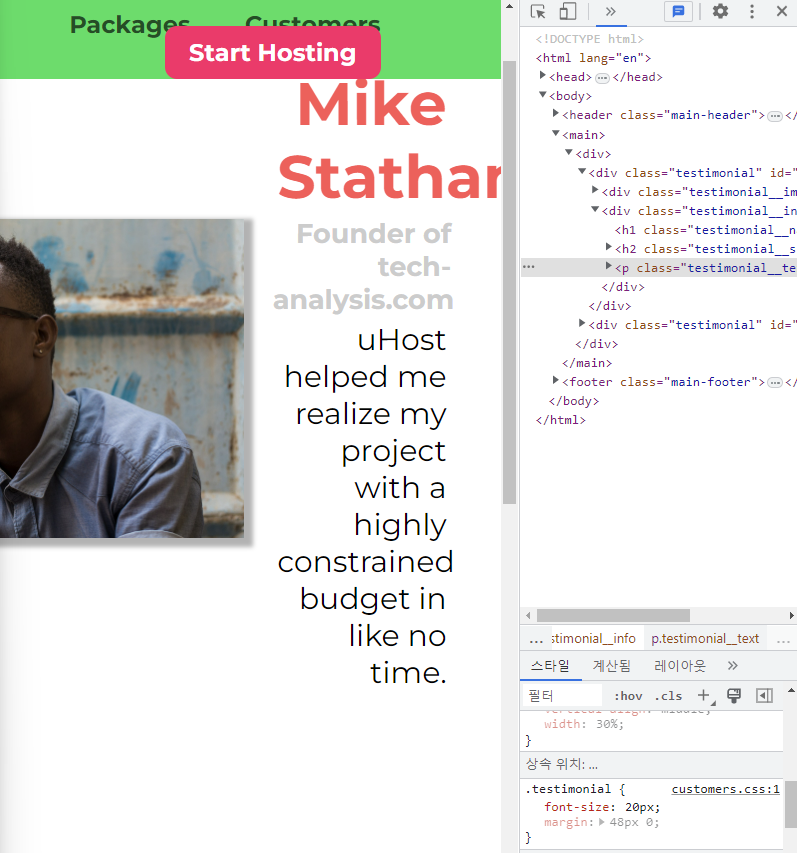

# 크기 와 단위
  
```
            <div class="testimonial" id="customer-1">
                <div class="testimonial__image-container">
                    
                </div>
                <div class="testimonial__info">
                    <h1 class="testimonial__name">Mike Statham</h1>
                    <h2 class="testimonial__subtitle">Founder of
                        <a href="tech-analysis.com">tech-analysis.com</a>
                    </h2>
                    <p class="testimonial__text">uHost helped me realize my project with a highly constrained budget in like no time.</p>
                </div>
            </div>
```
`testimonial__image-container`의 width 값이 퍼센트 이기 때문에 웹사이트가 보다 동적으로 작동하고 있다.  
하지만 예를 들어 폰트의 크기를 보면 브라우저의 크기를 늘리거나 줄여도 크기가 변하지 않는다.  
여전히 가독성이 좋기 때문에 크기가 변할 이유 또한 없다.  
  
하지만 웹사이트의 크기를 확대해보니 폰트 크기가 눈에 띄게 커지는다.  
물론 텍스트를 읽는데 어려움이 있는 사람들을 위해 크기가 조정할 수 있어야 하지만,  
이런 식으로 작동하게 되면 다양한 요소들이 확대되는 방식을 브라우저가 제어할 수 있게 된다.  
이는 우리가 원하는 방식이라고 할 수 없다.  
사용자들이 폰트 크기 등을 조정할 수 있는 것은 좋지만  
웹사이트의 전반적인 형태와 다양한 폰트 크기 사이의 비율 등은 그대로 유지가 되었으면 한다.  

  
따라서 이렇게 고정된 픽셀의 폰트 크기를 사용해서 브라우저 확대 기능을 사용하도록 하는 것은 그다지 좋은 방법 같지는 않다.  
그러면 한번 기본 폰트 사이즈를 `유연성` 있게 바꿔 보는 것은 어떨까?  
  
## Pixels(px), Percentage(%), and More
우리가 여태까지 사용 했던 단위는  
1. pixels(px)
2. percentages(%)
  
이 두개의 단위 외에도 `CSS`에서 사용할 수 있는 다위에는 몇가지가 더 있다.  
3. root em(rem)
   * 폰트 크기를 나타내는 단위
4. em
   * 폰트 크기를 나타내는 단위
5. viewport height (vh)
6. viewport width (vw)
  
사실 기존까지는 px 기본 단위를 제외한 나머지 단위에 대해서 자세하게 다룬적이 없다.  
그러면 크게 3가 궁금증이 생길 수 있다.  
1. 이들 단위를 어떤 프로퍼티에 적용할 수 있는가??
2. 이 단위들은 크기를 어떻게 계산하는가??
3. 그러면 과연 이 단위들을 어떤 프로퍼티에 적절하게 사용할 수 있을까??
  
### 어떤 프로퍼티에 적용할 수 있을까??
먼저 우리는 박스 모델을 가지고 작업한다.  
이 박스모델에는 `content`가 있다.  
이 영역의 크기를 지정하는 프로퍼티인 `font-size`에 px 외에도 다른 단위들을 사용할 수 있다.  
그 다음으로 박스 모델에서 우리는 `padding` 값을 지정해 줄 수 있고 그다음으로 `border` 과 `margin`값을 설정 해주었다.  
역시 `font-size`와 마찬가지로 다른 단위 값들을 해당 프로퍼티들에게 적용할 수 있다.  
  
다음으로 박스 모델에 적용할 수 있는 프로퍼티는 뭐가 있을까?  
가장 먼저 해당 박스모델의 너비(width)와 높이(height)가 있었다.  
그 다음으로 해당 박스모델의 위치를 조정할 수 있는 `position`과 관련된 프로퍼티인 `top,bottom, left, right` 가 있다.
  
* font-size
* padding, border, margin
* width , height
* top, bottom
* left, right


