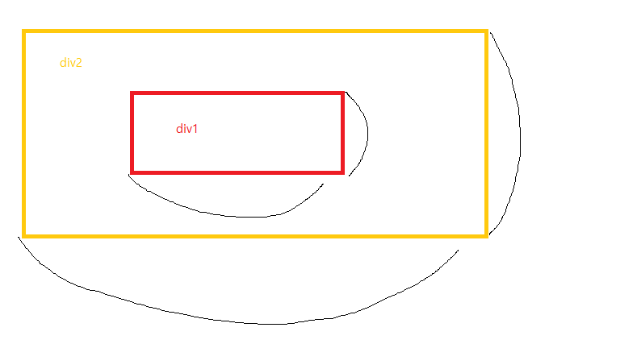
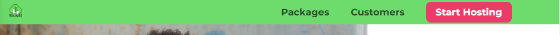
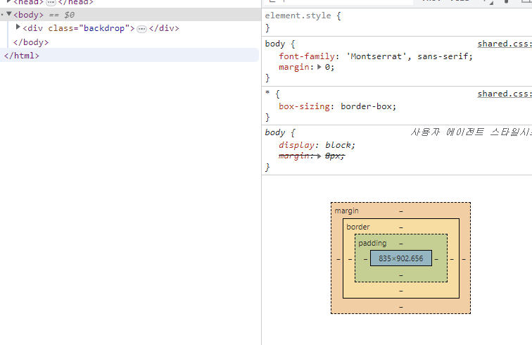
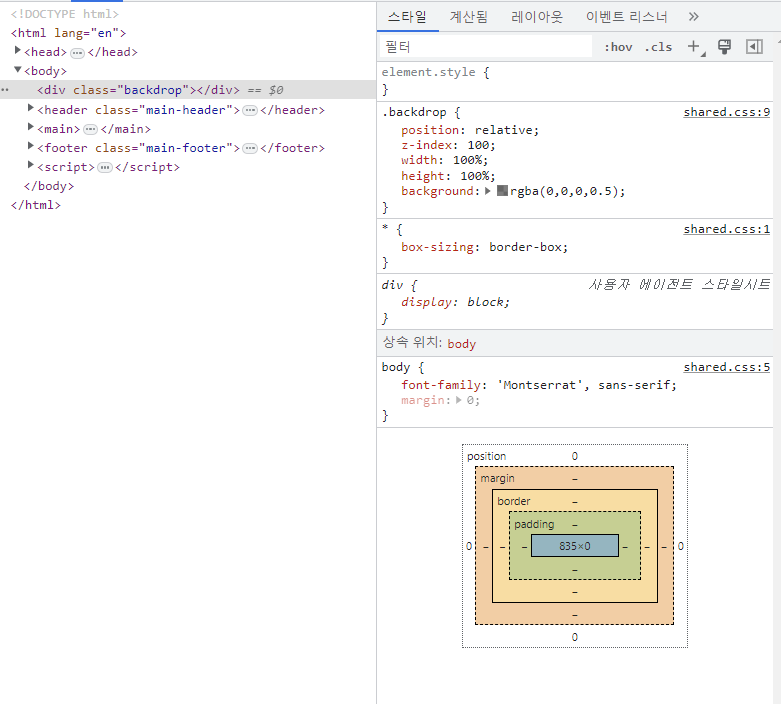
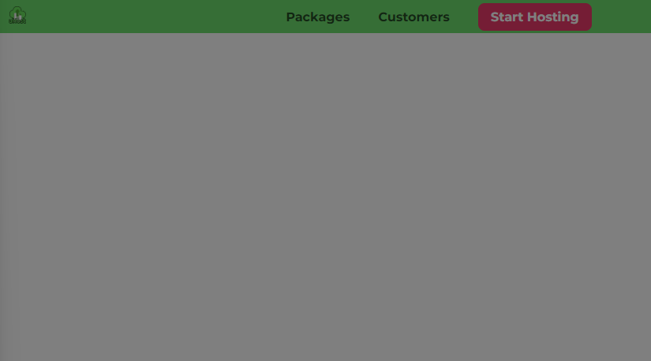
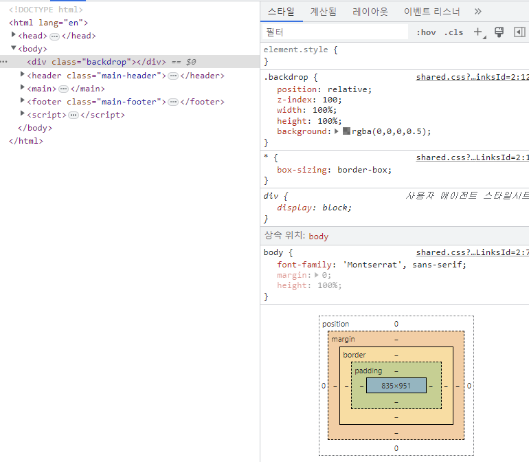
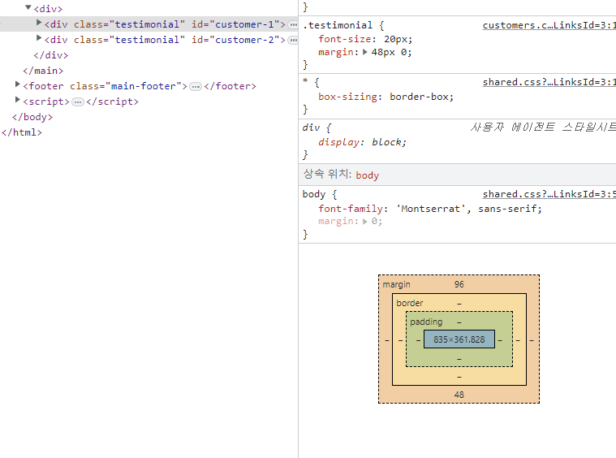
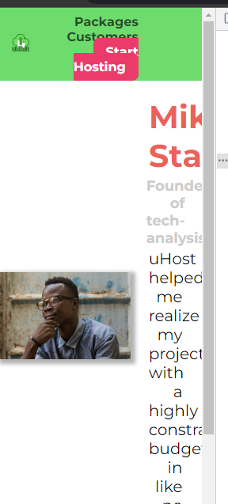
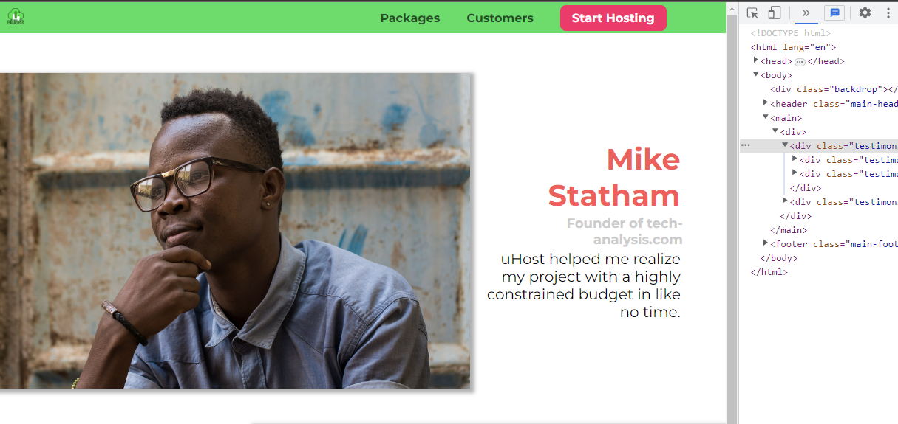

# 크기 와 단위
  
```
            <div class="testimonial" id="customer-1">
                <div class="testimonial__image-container">
                    
                </div>
                <div class="testimonial__info">
                    <h1 class="testimonial__name">Mike Statham</h1>
                    <h2 class="testimonial__subtitle">Founder of
                        <a href="tech-analysis.com">tech-analysis.com</a>
                    </h2>
                    <p class="testimonial__text">uHost helped me realize my project with a highly constrained budget in like no time.</p>
                </div>
            </div>
```
`testimonial__image-container`의 width 값이 퍼센트 이기 때문에 웹사이트가 보다 동적으로 작동하고 있다.  
하지만 예를 들어 폰트의 크기를 보면 브라우저의 크기를 늘리거나 줄여도 크기가 변하지 않는다.  
여전히 가독성이 좋기 때문에 크기가 변할 이유 또한 없다.  
  
하지만 웹사이트의 크기를 확대해보니 폰트 크기가 눈에 띄게 커지는다.  
물론 텍스트를 읽는데 어려움이 있는 사람들을 위해 크기가 조정할 수 있어야 하지만,  
이런 식으로 작동하게 되면 다양한 요소들이 확대되는 방식을 브라우저가 제어할 수 있게 된다.  
이는 우리가 원하는 방식이라고 할 수 없다.  
사용자들이 폰트 크기 등을 조정할 수 있는 것은 좋지만  
웹사이트의 전반적인 형태와 다양한 폰트 크기 사이의 비율 등은 그대로 유지가 되었으면 한다.  

  
따라서 이렇게 고정된 픽셀의 폰트 크기를 사용해서 브라우저 확대 기능을 사용하도록 하는 것은 그다지 좋은 방법 같지는 않다.  
그러면 한번 기본 폰트 사이즈를 `유연성` 있게 바꿔 보는 것은 어떨까?  
  
## Pixels(px), Percentage(%), and More
우리가 여태까지 사용 했던 단위는  
1. pixels(px)
2. percentages(%)
  
이 두개의 단위 외에도 `CSS`에서 사용할 수 있는 다위에는 몇가지가 더 있다.  
3. root em(rem)
   * 폰트 크기를 나타내는 단위
4. em
   * 폰트 크기를 나타내는 단위
5. viewport height (vh)
6. viewport width (vw)
  
사실 기존까지는 px 기본 단위를 제외한 나머지 단위에 대해서 자세하게 다룬적이 없다.  
그러면 크게 3가 궁금증이 생길 수 있다.  
1. 이들 단위를 어떤 프로퍼티에 적용할 수 있는가??
2. 이 단위들은 크기를 어떻게 계산하는가??
3. 그러면 과연 이 단위들을 어떤 프로퍼티에 적절하게 사용할 수 있을까??
  
### 어떤 프로퍼티에 적용할 수 있을까??
먼저 우리는 박스 모델을 가지고 작업한다.  
이 박스모델에는 `content`가 있다.  
이 영역의 크기를 지정하는 프로퍼티인 `font-size`에 px 외에도 다른 단위들을 사용할 수 있다.  
그 다음으로 박스 모델에서 우리는 `padding` 값을 지정해 줄 수 있고 그다음으로 `border` 과 `margin`값을 설정 해주었다.  
역시 `font-size`와 마찬가지로 다른 단위 값들을 해당 프로퍼티들에게 적용할 수 있다.  
  
다음으로 박스 모델에 적용할 수 있는 프로퍼티는 뭐가 있을까?  
가장 먼저 해당 박스모델의 너비(width)와 높이(height)가 있었다.  
그 다음으로 해당 박스모델의 위치를 조정할 수 있는 `position`과 관련된 프로퍼티인 `top,bottom, left, right` 가 있다.
  
* font-size
* padding, border, margin
* width , height
* top, bottom
* left, right
  
### 단위들은 크기를 어떻게 계산하는가??
* 절대 길이
  * 대부분의 경우 사용자 설정을 무시한다.
  * `px`
    * 폰트 사이즈가 px 단위로 설정된 웹사이트에서 크롬에서 확대 하거나 폰트 크기를 변겯해도 웹사이트의 폰트 크기는 변하지 않는다.
* viewport 길이
  * 이름처럼 화면에서 보여지는 각 요소의 크기를 조절할 때에 사용한다
    * 즉, 브라우저에 웹사이트가 출력되는 부분을 나타냄
  * `vh`, `vw` , `min`, `max`
* 폰트 상대적 길이
  * 기본 폰트 크기 조정시에 사용
  * `rem`, `em`, 
* 특수 케이스 : 백분율
  * 왜 특수 케이스 일까??

### 특수 케이스 백분율
`%` 단위를 쓰는 경우 어떻게 박스 크기를 계산하는 것일 까??  
  
여기서 중요하게 살펴볼 것은 지금 이 안쪽 `div1`의 `height` 와 `width` 값이 퍼센트 값으로 표시 되어 있다고 가정했을때  
이때 이 높이와 너비는 정확히 어떤 값을 가리키는 것일까??  
만약 width 값이 `80%`라고 할때 어떤 기준에 대한 퍼센트 값일까??  
부모 요소에 대해서 `80%` 일까?  
본문 요소에 대한 `80%`? 이도 아니면 `html` 요소가 기준일까?? 혹은 우리가 모르는 다른 요소 일까??  

### position:fixed 와 백분율
그러면 특수 케이스라고 했는데 무엇이 특수한 것일까??  
바로 이 선언 때문인데 바로 `position:fixed` 이다.  
왜 갑자기 `position` 프로퍼티가 갑자기? 라고 생각할 수 있지만  
`%` 단위의 동작 원리에 이 `position` 프로퍼티가 큰 영향을 주기 때문이다.  
  
`%`단위를 사용하는 요소의 기준점을 `컨테이닝 블록` 이라고 하는데  
만약 부모 요소의 너비가 `100px`인 요소가 있으면 이 부모요소가 컨테이닝 블록이 될 수 있다.  
이 부모 요소가 `컨테이닝 블록`이라면 어떻게 `컨테이닝 블록` 즉 기준점을 찾는 것일까??  
이때 자식 요소의 너비가 `10%`라면 이는 `10px`이고 해당 부모요소의 너비는 `100px`이 라는 것을 알 수 있다.  
  
단, `컨테이닝 블록`은 해당 요소의 `position` 프로퍼티에 따라 달라지는데  
`position` 프로퍼티가 값이 `fixed`일때 컨테이닝 블록은 요소가 아니라 `뷰포트`로 인식 됩니다.   



```
.main-header {
    width: 100%;
    position: fixed;
    top: 0;
    left: 0;
    background: #2ddf5c;
    padding: 8px 16px;
    z-index: 1;
}
```
우리가 기존에 스타일링한 네비게이션 바를 보면  
`position:fixed`가 있기 때문에 `width: 100%` 퍼센트 값의 `커테이닝 블록`은 뷰포트가 되고 이 뷰포트를 기준으로 `width를 100%`값을 지정한 것이다.  
  
  
### position:absolute 와 백분율  
`position`프로퍼티의 값이 `absolute`라면 `컨테이닝 블록`은 조상을 가리킨다.  
이때 `컨테이닝 블록`은 `조상의 컨텐츠, padding`을 기준으로 한다.  
즉, 이 요소의 `width`에 대해 백분율 단위를 쓴다고 하면 컨테이닝 블록으로서 조상의 콘텐츠 와 패딩의 너비를 기준으로 삼는다.  
그렇다면 여기서 어떤 요소가 컨테이닝 블록이 되는지가 관건이다.  
이때 요소라 함은 `position`프로퍼티가 적용돼 있어야 한다.  
  
다시말해 `position:absolute`인 요소의 컨테이닝 블록은 `position`이 정적 값이 아닌 가장 인접한 조상이 된다.  
```
* position:absolute;
* position:relative;
* position:fixed;
* position:sticky;
```

### position:relative/static 와 백분율
`position` 프로퍼티의 값이 `relative/static`인 요소의 `컨테이닝 블록`은 `absolute`와 같이 조상을 가르킨다.  
하지만 이번에는 조상의 콘텐츠에만을 기준으로 한다.  
그러면 기준으로 삼게 되는 조상은 가장 가까운 블록 레벨 요소가 조상 된다.
  
### height 가 100% 일때
팝업 창이 나왔을때 주변 배경색이 약간 흐리게 하는 효과를 만들어 보자  
```
.backdrop {
    position: relative;
    z-index: 100;
    width: 100%;
    height: 100%;
    background: rgba(0,0,0,0.5);
}

```
```
<body>
    <div class="backdrop"></div>
    .....
</body>    
```
  
  
하지만 위와 같이 페이지에 표시되는 것이 아무것도 없다.  
왜 이렇게 작동되는지 한번 살펴보자  
먼저 해당 `<div class="backdrop"/>`는 `position: relative;`가 적용 되어있기 때문에  
기준점인 컨테이닝 블록은 가장 가까운 조상 요소가 된다.  
즉 이경우에는 조상 요소가 `body`요소가 된다.  
  
  
따라서 `width, height`의 값은 박스 모델에서 확인할  수 있듯이 `width`값은 `컨테이닝 블록(body)`의 width 값과 같다.  
하지만 높이는 제대로 적용되지 않았다.  
왜 이런 현상이 발생하는 것일까??  
자세하게 살펴 보면 width 값은 박스 모델에서만 봐도 정의되어 있는것을 확인할 수 있지만  
`height`의 경우에는 그 높이가 콘텐츠영역을 통해 정의되는데  
지금 박스모델에 나와 있는 height 정보로는 `height프로퍼티의 100%` 라는 선언을 출력해 낼 수가 없다.  
  
그러면 이런 방법을 해결하기 위해서는 어떻게 해야할까?  
  
### 해결책1
먼저 백분율 단위를 사용하는 방식을 해결하고자 한다면
```
html {
    height: 100%;
}
body {
    height: 100%;
}
```
    
이렇게 적용하면 제대로 우리의 `backdrop`이 정상 작동하는 것을 확인할 수 있다.  
물론 `backdrop`이 `relative`이기 때문에 문서대열에서 제외되지 않았기 때문에 밑에 기존의 콘텐츠가 여전히 남아 있지만  
여기서 중요한 것은 `body` 요소에 `height:100%`값을 추가 했다는 것이다.
    
이렇게 해당 선언을 추가하면 아래 박스 모델에서 처럼 높이 값이 생기는 것을 확인할 수 있다.  

### 해결책2
```
.backdrop {
    position:absolute;
    z-index: 100;
    width: 100%;
    height: 100%;
    background: rgba(0,0,0,0.5);
}
```
`.backdrop`의 position 값을 `absolute`로 변경한다.  
    
잘적용되는 것을 확인할 수 있다.  
그이유는 position 값이 absolute 일때 컨테이닝 블록은 `position` 프로퍼티 값이 설정되어 있지 않다면 백분율 값은 뷰포트를 컨테이닝 블록으로 설정하고 기준으로 삼는다.  
하지만 여전히 문제점이 있다.  
먼저 맨위에 발생하는 이 간격, 여백 상쇄가 그 원인이다.  
  
  
main 선택자 안에 `div.testimonial` 요소를 보면 margin-top 과 margin-bottom 값을 확인할 수 있다.  
  
해당 margin 값을 잠시 해제하면 `.backdrop`이 패이지 전체를 덮도록 변경된 것이 확인할 수 있다.  
그렇다면 이 여백 상쇄는 어떻게 해결할 수 있을까??
```
.backdrop {
    position:fixed;
    top: 0;
    left: 0;
    z-index: 100;
    width: 100%;
    height: 100%;
    background: rgba(0,0,0,0.5);

}
```
top 과 left 프로퍼티의 값을 0으로 설정해 추가하고 결과를 확인해보면  
  
완벽하게 작동하는 것을 확인할 수 있다.
  
## min-width/min-height
다른 단위를 알아보기 전에 픽셀과 백분율의 재미있는 조합을 하나 보고 가보자  
좀더 자세한 것은 반응형 디자인 파트에서 자세하게 다룰 것이다.  
  
  
  
위와 같이 특정 요소가 지나치게 작아지거나 커지는 것을 확인할 수 있다.  
자세한 내용은 반응형에서 다시 살펴보고 그전에 이미지, 혹은 이미지 크기가 어떻게 적의되었는지 알아보자  
이 이미지는 이미지 컨테이너 안에 있고 이 이미지 컨테이너는 width 가 65% 이고 이미지는 width 100% 값을 가지고 있다.  
또한 이 이미지 컨테이너의 컨테이닝 블록은 가장 가까운 조상요소인 div 태그고 블록레벌로 화면의 전체 width 값을 가지고 있다.  


