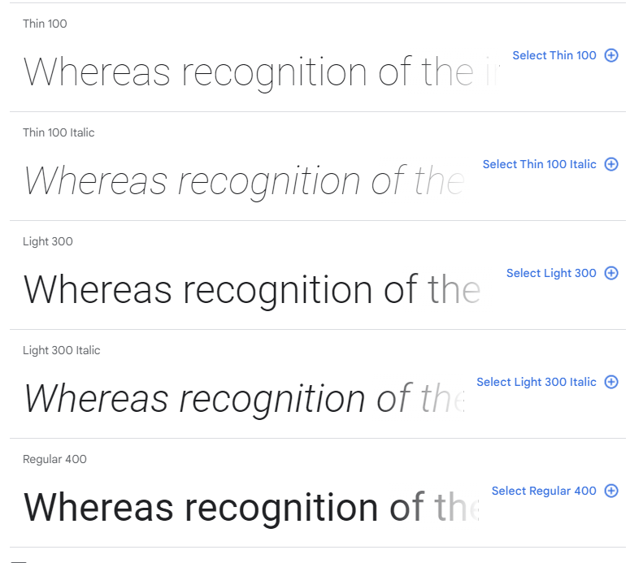
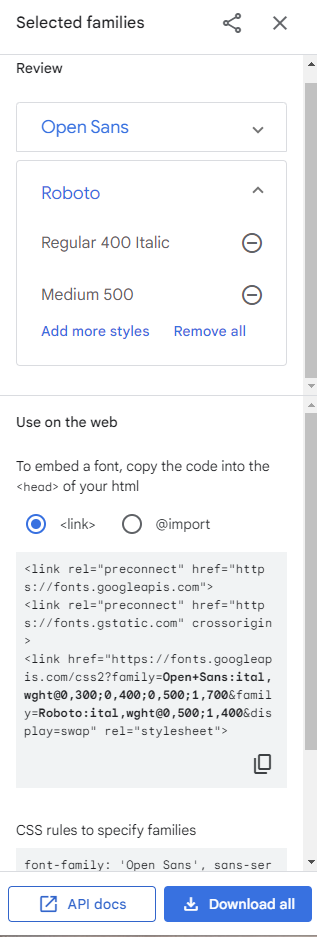
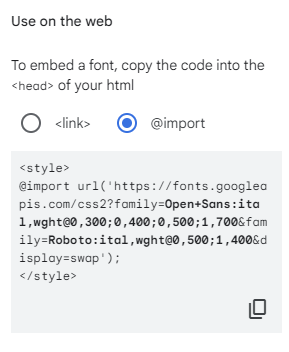
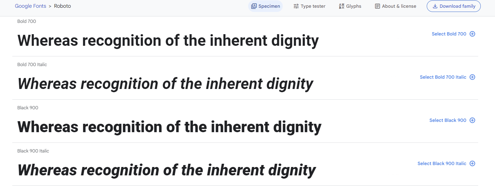
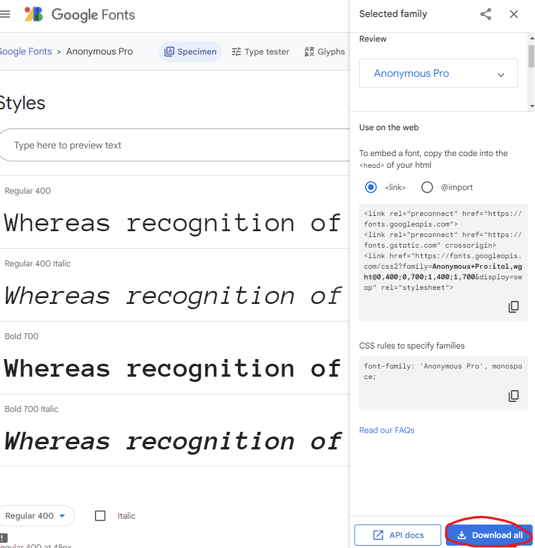
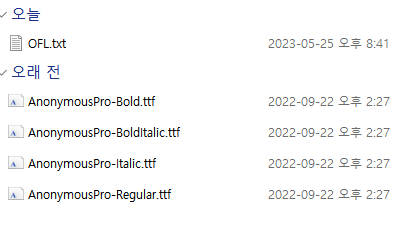

# 텍스트 및 폰트

## 제네릭 패밀리 와 폰트 패밀리
* 제네릭 패밀리
  * 일종의 헤드라인으로 안에 속한 **폰트**의 특정 속성을 지정
  * **serif** : 획의 삐침이 있는 폰트
  * **sans-serif** : 획의 삐침이 없음
  * **cursive** : 필기체
  * **monospace**
  * fantasy 등
  
* 폰트 패밀리
  * 폰트 패밀리는 제네릭 패밀리에 속하는 다른 폰트와 다르다
  * 각각의 폰트는 서로 다르지만 같은 특징의 제네릭 패밀리를 공유한다.
  * serif
    * Georgia
    * Times New Roman
  * sans-serif
    * Helvetica
    * Verdana
  * cursive
    * Brush Script
    * Mistral
  * monospace
    * Courier New
    * Lucida Bright
  
### 정리
특정 핵심 속성을 지정하는 `제네릭 패밀리`가 있고 그 안에 일반적인 속성은 공유하지만  
생김새는 다른 여러 다양한 `폰트 패밀리`가 존재한다.
  
## 브라우저 설정 이해하기
브라우저에서 **제네릭 패밀리**와 **폰트 패밀리**를 찾는 방법에 대해 알아보자  
일단 크롬 기준으로 진행하기 때문에 메뉴나 선택한 스타일이 브라우저 마다 다르게 보일 수도 있다.  
하지만 일반적인 개념은 동일하다.  
브라우저 설정창에 들어가서 메뉴에서 모양을 클릭하고 글꼴란에 가면 해당 설정을 확인할 수 있다.  
  
  
여기서 브라우저에 의해 기본적으로 적용되는 `표준 글꼴`이 있다.  
여기에는 다양한 `폰트 패밀리`를 선택할 수 있다.  
이것 들은 제네릭 패밀리가 아니라 폰트 패밀리 이다.
  
그 밑에 메뉴를 보면 `Serif`가 있다.  
이건 `제네릭 패밀리`이다. 제네릭 패밀리에도 폰트 패밀리를 선택할 수 있다.  
여기서 중요한점은 해당 목록에는 `Sans-serif` 에 속한 폰트 패밀리는 들어 있지 않다.  
  
그리고 그밑에 `고정폭 글꼴`이라는 메뉴도 있다.  
이전에 설명한 `monospace` 패밀리가 여기에 속해 있다.  
  
하지만 여기서 하나의 의문점이 생긴다.  
바로 브라우저는 이 중 어떤 폰트를 사용하는지 의문이 생긴다.  
### 브라우저에서는 어떤 폰트가 쓰일까??
왜냐면 우리는 설정 창에서 표준 글꼴 과 여러 제네릭 패밀리 안에서 폰트 패밀리를 선택할 수 있다.  
여기서 시작점은 우리가 웹사이트를 탐색하게 되면 브라우저가 웹사이트를 보여주는데  
이때 폰트를 결정하는 기본 동작(Default)은 바로 브라우저가 결정하게 된다.  
그리고 이 기본값은 우리가 위에서 확인한 **표준 글꼴**이 여기에 해당한다.  
  
> 그러면 기본 동작이란 뭘까??
> 기본 동작이란 CSS 코드에서 폰트 패밀리를 지정하지 않으면 브라우저가 적용하는 기본 폰트를 선택하고  
그렇게 선택한 폰트 패밀리를 적용하는 것을 말한다.
   
  
또 다른 옵션은 제네릭 패밀리이다.  
CSS 코드에 제네릭 패밀리를 정의할 수 있다. 우리가 확인한 폰트 중 하나를 선택해 사용할 수 있다.  
우리가 브라우저 설정에서 다른 제네릭 패밀리에 대한 다른 폰트 패밀리를 선택할 수 있다.  
우리는 CSS코드를 통해 브라우저에게 특정 제네릭 패밀리를 선택하게 할 수 있다.  
  
마지막 옵션은 폰트 CSS 코드에 폰트 패밀리를 정의 하는 것이다.  
이는 브라우저 설정의 직접적인 영향을 받지 않는다.  
브라우저 설정에선 다양한 폰트 패밀리를 설정할 수 있지만 사용자의 브라우저에서 기본적으로 제공하지 않는  
폰트를 사용하도록 CSS 코드에 선택할 수 있다. 이 경우 어디에서 폰트 패밀리를 가져올지 지정해 줘야한다.  
1. 사용자의 컴퓨터
   1. CSS 코드에 지정한 폰트 패밀리를 사용자 컴퓨터에 저장해서 이를 참조한다.  
   
문제점 으로는 로컬 컴퓨터 이기 때문에 특정 폰트 패밀리의 설치 여부를 제어할 수 업다.    
따라서 웹사이트의 폰트가 사용자마다 다르게 보일 가능성이 높다.
  
2. 웹 폰트
   1. 제 3자로부터 폰트를 가져온다.
   2.ex) Google Fonts
  
3. 서버
   1. 웹사이트를 호스팅하는 고유 서버에서 폰트를 가져온다.
      

## font-family 프로퍼티
`font-family` 프로퍼티는 특정한 패턴을 따른다.  
```
font-family: "Montserrat", sans-serif;
```
여기서 첫번째 값인 **Montserrat**값이 바로 우리가 지정할 폰트 패밀리 이다.  
이때 대문자와 큰따옴표(")이를 잊으면 안된다. 큰따옴표가 반드시 필요한 건 아니지만 폰트 패밀리 이름으 여러 어절이라면 큰따움표가 필요하다.  
혹은, 이름에 공백이 있으면 큰따옴표가 있어야 한다.
이폰트 패밀리에 다음에 오는 `sans-serif`는 제네릭 패밀리이다.  
  
어느정도 패턴이 눈에 보이기 시작할 것이다. 가장 구체적인 것 부터 쓰는데 가장 구체적인 것이 보통 폰트 패밀리다.  
이때 폰트 패밀리는 둘 이상일 수도 있다.  
```
font-family: "Montserrat","Verdana", sans-serif;
```
이렇게 작성하게 되면 브라우저는 먼저 `Montserrat`를 찾게 되고 해당 폰트 패밀리를 찾지 못할 경우  
다음 폰트 패밀리인 `Verdana`를 찾게 되고 이또한 못찾으면 다음 폰트 패밀리로 넘어가는 걸 반복한다.  
최종적으로 브라우저는 제네릭 패밀로 대체한 후 브라우저 설정에서 정의한 제네릭 패밀리에서 골라 폰트를 적용하게 된다.  
  
   
```
body {
  font-family: "Unkown", sans-serif;
  margin: 0;
}
```
  

### 정리
첫 번째는 `폰트 패밀리`를 지정하고 그 이후에는 여러 개의 폰트 패밀리를 지정할 수 있다.  
하지만 마지막에는 제네릭 패밀리를 지정해 주어야한다.  
그래야 웹 사이트의 텍스트를 안전하게 표시할 수 있다.

  
## 로컬 폰트 패밀리 
지금 까지 우리가 폰트에 대한 문제가 발생하지 않았던 이유는 브라우저에서 해당 폰트릴 지원했기 때문이다.  
브라우저 설정에서도 다양한 기본 폰트를 지원하는 것을 알 수 있다.  
하지만 여기서 우리는 명심해할게 있는데 바로 **웹 사이트 방문자가 쓰는 브라우저의 폰트를 우리가 결정 할 수 없다는 것이다.**  
따라서 방문자가 크롬을 사용하지 않을 경우 우리는 **웹 폰트**를 제외하고 새로운 접근 방식이 필요하다.  
모든 사용자가 해당 폰트를 사용할 수 있지는 않아서 **대안 폰트**가 필요하다.  
> [css font stack](https://www.cssfontstack.com/) 사이트에서 어떤 폰트패밀리가 설치되어 있는지 확인할 수 있다.
  
즉, `font-family` 프로퍼티를 추가하는 것으로는 부족하다.  
만약 웹폰트를 추가하지 않을 경우 우리는 두가지 방법에 기댈 수 밖에 없다.  
먼저 사용자의 기기에 우리가 지정한 폰트 패밀리가 기본 혹은 어떻게든 설치되어있거나  
브라우저가 이 폰트 패밀리를 인지해야 페이지에 표시가 될 것이다.  
여기서 가장큰 문제는 우리가 이 두가지 방법을 제어하지 못한다는 점이다.  
폰트 패밀리를 설치하게 만들거나 특정 브라우저를 사용하도록 사용자에게 강요할 수 없기 때문이다.  
  
이를 위해 사용하는 폰트 패밀리가 널리 사용되는지 확인하려면 [css font stack](https://www.cssfontstack.com/)  
에서 가능한 폰트 패밀를 확인하자 하지만 설치되어있는 폰트패밀리를 사용하는 것은 기본 폰트 패밀리에  
제한되는 것이기 때문에 좋은 방법은 아니다.  
  
## 웹 폰트
웹 폰트 중에 대표적인 것이 우리가 이전에 사용했던 **Google Fonts**이다.  
Google Fonts의 좋은 점은 사용자 정의에 따라 바로바로 폰트 패밀리를 확인할 수 있다.  
다양한 폰트 패밀리는 카테코리별로 확인할 수 있다.  
또한 선택한 폰트패밀리 내에도 다양한 옵션들이 존재한다.  
이 옵션들을 바로 `font-face`라고 한다.
  
  
이 옵션은 제네릭 패밀리에 관계된 아주 중요한 개념이다.  
해당 예시는 **Roboto** 라는 **Sans Serif** 제네릭 패밀리에 속한 폰트 패밀리이다.  
이 폰트 패밀리 **Roboto** 에는 여러 `font-face`가 있는데  
예를들어 **Light 300**은 폰트 굵기인 `font-weight` 부분이며 **Italic** 부분은 폰트 스타일 이다.  
  
이렇게 사용자가 원하는 `font-face`를 선택하고 우측 상단 메뉴를 클릭하면 :  
  
우리가 선택한 폰트 패밀리를 코드로 가져올 수 있다.  
이런식으로 우리 html 파일 우리가 원하는 폰트를 추가할 수 있다.    
추가할때 여태까지 우리 페이지에서 문제가 발생하지 않았던 이유는 모든 디렉토리의 `index.html`에 폰트를 추가 했기 때문이다.  
그러나 만약 새로운 폰트 패밀리를 추가하기 위해서는 모든 기본 `index.html`에 작업을 수행해야만 한다.  
이렇게 각각의 HTML 파일에 링크를 추가하지 않으면 원하는 페이지에 폰트를 못 쓰고 따라서 오류가 발생하게 된다.  
  
그래서 웹 폰트를 추가하는 더 좋은 방이 있을 것같다.  
바로 `@import` 옵션이다:  
  
해당 명령어를 사용하면 CSS 파일에 폰트를 가져올 수 있다.
  
## Font Face 와 font-style
그러면 도대체 위에서 잠깐 언급했던 `Font Face`는 무엇일까??  
기본적으로 해당 옵션에 있는 `Thin, Light, Regular, Meduim, Bold...`는 `폰트의 굵기` 를 나타낸다.  
그럼 먼저 `font-weight(폰트 굵기)`가 무엇인지 살펴 보도록 하자
이 font-weight 프로퍼티의 값으로는 기본적으로 100 에서 900사의 숫자 값을 줄 수 있고 당연히 숫자 클수록 폰트의 굵기가 두꺼워진다.  
숫자외에 `bolder(상속된 폰트보다 더 두꺼운 굵기), inherit..`등도 값으로 줄 수 있다.  
  
여기서 우리는 숫자 값에 주목해보자.  
숫자는 폰트의 굵기를 지정하며 이때 400은 보통의 폰트 굵기를 뜻합니다.  
이때 400 대신 normal 이라는 값을 지정해 줘도 가능하다.  
또 700은 bold와 같다.
```
.package__info {
    padding: 1rem;
    border: 1px solid #0e4f1f;
    font-size: 1.2rem;
    color: #0e4f1f;
    background: white;
    font-family: 'Roboto', sans-serif;
    font-weight: bold;
}
```
  
여기서 font-weight을 900 으로 변경하면 어떻게 될까??  
```
.package__info {
    padding: 1rem;
    border: 1px solid #0e4f1f;
    font-size: 1.2rem;
    color: #0e4f1f;
    background: white;
    font-family: 'Roboto', sans-serif;
    font-weight: bold;
}
```  
  
  
이상하게도 아무런 변화가 없다. 상당히 이상한 일이다.기존 bold(700)보다 살짝 더 굵어 져야 정상 작동하는 것이 아닐까??  
다시 Google Fonts 로 돌아가서 900이라는 숫자가 정의되어 있기 때문이다.  
  
  
문제는 지금까지 우리가 기본 **font-face**인 **Regular 400**만 import 했기 때문이다.  
만약 900 스타일을 사용하려면 해당 옵션을 추가해서 다시 import 해야만 우리가 font-weight : 900 값을 주었을때 변경되게 된다.  
우리가 사용할 font-weight 들을 font-face 옵션에서 선택해서 가져와야 한다.  
  
즉, 개별 또는 대부분의 폰트 패밀리에 서로 다른 font-face 가 적용되니 우리는 모든 font-face 를 웹 사이트에 임포트 해야 한다.  
이걸로 폰트 굵기를 변경할 수 있다.  
  
또 font-face 에 영향을 주는 파라미터가 있는데 그것이 **Italic** 이 있고 이는 **폰트 스타일**이다.  
예를 들어 Thin 100 Italic 을 추가적으로 import 하면:
```
.package__info {
    padding: 1rem;
    border: 1px solid #0e4f1f;
    font-size: 1.2rem;
    color: #0e4f1f;
    background: white;
    font-family: 'Roboto', sans-serif;
    font-weight: 100;
    font-style: italic;
}
```
  
  
## 사용자 지정 폰트
우선 우리가 새로운 폰트를 만드는 작업을 하는 것이 아니기 때문에 기존 폰트를 다운 받아서 지정해보자  
  
폰트를 다운로드 하고 압축을 풀어보면 네개의 ttf 파일이 나온다.
  
파일명과 어떤 파일인지에 대해선 조금 있다가 자세하게 설명할 것이다.  
일단 이 네개의 font-face 파일 `Bold, BoldItalic, Italic, Regular`중에 **Regular**를 페이제 추해보자  
먼저 추가하기 위해서는 추가할 CSS 파일에서 `@font-face` 명령어 추가할 수 있다.  
```
@font-face {
    font-family: "AnonymousPro";
    src: url(""AnonymousPro-Regular.ttf"");
}
```
위와 같이 font-family 의 이름과 해당 소스의 위치를 지정하면 되는데 우리는 URL을 입력할 수 없기 때문에  
해당 다운받은 폰트를 작업 패키지에 옮겨두고 작업을 이어나가자  
이렇게 적용하면 사용자 지정 폰트 페이스를 가져오는 것이 완료되었다.  
```
.package__info {
    padding: 1rem;
    border: 1px solid #0e4f1f;
    font-size: 1.2rem;
    color: #0e4f1f;
    background: white;
    /*font-family: 'Roboto', sans-serif;*/
    font-family: 'AnonymousPro', sans-serif;
}
```
  
  
이렇게 간단하게 커스텀 폰트를 우리 웹사이트에 적용할 수 있는데  
### 왜 늘 이 방법을 사용하지 않을까??
다시 Google Fonts 로 가보면 여기에는 여러 font-face 가 존재한다.  
우리가 추가한 커스텀 폰트에 font-weight 프로퍼티를 추가해보면 Regular 폰트 패밀리만 가져 왔기 때문에 적용되지 않았다.  
```
@font-face {
    font-family: "AnonymousPro";
    src: url("anonymousPro-Bold.ttf");
}
```  
이렇게 코드를 추가한다 해도 현재 사용한 코드가 정확한 건 아니다.  
코드를 확인해보면 소스는 다르지만 폰트에는 별 차이가 없다.  
그렇다면 브라우저나 코드가 가져온 두 폰트 페이스의 차이를 어떻게 구분할까??  
이상태에서 `font-weight`을 400 에서 700으로 변경해도 아무런 일도 발생하지 않는다.  
그 이유는 나중에 추가한 `anonymousPro-Bold.ttf` 이코드가 이전 코드를 덮어 쓰기 때문이다.  
따라서 구분을 위해서 `@font-face` 에 `font-wight`프로퍼티를 추가로 작성해준다.  
```
@font-face {
    font-family: "AnonymousPro";
    src: url("anonymousPro-Bold.ttf");
    font-weight: 700;
}
```
  
## 포맷
```
@font-face {
    font-family: "AnonymousPro";
    src: url("anonymousPro-Regular.ttf") format("truetype");
}
@font-face {
    font-family: "AnonymousPro";
    src: url("anonymousPro-Bold.ttf") format("truetype");
    font-weight: 700;
}

```
  
지금 코드도 아무런 문제점이 없지만 브라우저에게 좀더 확실한 정보를 전달하기 위해 `format`의 폰트인지를 알려 줄 수 있다.  
즉, 브라우저에게 우리가 지정한 폰트가 어떤 확장자인지 추가 적인 정보를 전달해 줄 수 있다.  
[can i use](https://caniuse.com/?search=ttf) 사이트 에 들어가서 확장자별 브라우저 지원현향을 알 수 있다.  
```
@font-face {
    font-family: "AnonymousPro";
    src: url("anonymousPro-Regular.woff2") format("woff2"),
    url("anonymousPro-Regular.woff") format("woff"),
    url("anonymousPro-Regular.ttf") format("truetype");
}
```
* .ttf -> truetype
* .otf -> Open Type
* .woff -> Web Open Font Format
* .eot -> Embeded Open Type Fonts (오직 IE 에서만 지원)