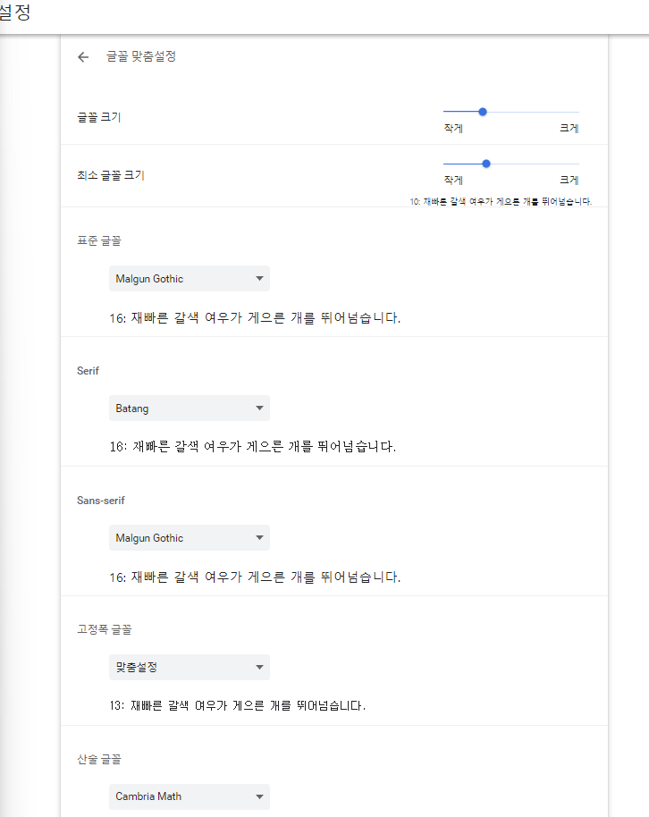
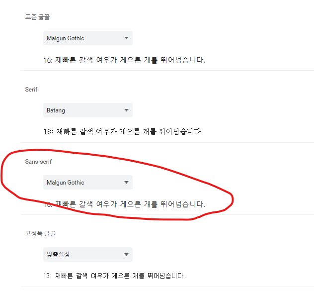

# 텍스트 및 폰트

## 제네릭 패밀리 와 폰트 패밀리
* 제네릭 패밀리
  * 일종의 헤드라인으로 안에 속한 **폰트**의 특정 속성을 지정
  * **serif** : 획의 삐침이 있는 폰트
  * **sans-serif** : 획의 삐침이 없음
  * **cursive** : 필기체
  * **monospace**
  * fantasy 등
  
* 폰트 패밀리
  * 폰트 패밀리는 제네릭 패밀리에 속하는 다른 폰트와 다르다
  * 각각의 폰트는 서로 다르지만 같은 특징의 제네릭 패밀리를 공유한다.
  * serif
    * Georgia
    * Times New Roman
  * sans-serif
    * Helvetica
    * Verdana
  * cursive
    * Brush Script
    * Mistral
  * monospace
    * Courier New
    * Lucida Bright
  
### 정리
특정 핵심 속성을 지정하는 `제네릭 패밀리`가 있고 그 안에 일반적인 속성은 공유하지만  
생김새는 다른 여러 다양한 `폰트 패밀리`가 존재한다.
  
## 브라우저 설정 이해하기
브라우저에서 **제네릭 패밀리**와 **폰트 패밀리**를 찾는 방법에 대해 알아보자  
일단 크롬 기준으로 진행하기 때문에 메뉴나 선택한 스타일이 브라우저 마다 다르게 보일 수도 있다.  
하지만 일반적인 개념은 동일하다.  
브라우저 설정창에 들어가서 메뉴에서 모양을 클릭하고 글꼴란에 가면 해당 설정을 확인할 수 있다.  
  
  
여기서 브라우저에 의해 기본적으로 적용되는 `표준 글꼴`이 있다.  
여기에는 다양한 `폰트 패밀리`를 선택할 수 있다.  
이것 들은 제네릭 패밀리가 아니라 폰트 패밀리 이다.
  
그 밑에 메뉴를 보면 `Serif`가 있다.  
이건 `제네릭 패밀리`이다. 제네릭 패밀리에도 폰트 패밀리를 선택할 수 있다.  
여기서 중요한점은 해당 목록에는 `Sans-serif` 에 속한 폰트 패밀리는 들어 있지 않다.  
  
그리고 그밑에 `고정폭 글꼴`이라는 메뉴도 있다.  
이전에 설명한 `monospace` 패밀리가 여기에 속해 있다.  
  
하지만 여기서 하나의 의문점이 생긴다.  
바로 브라우저는 이 중 어떤 폰트를 사용하는지 의문이 생긴다.  
### 브라우저에서는 어떤 폰트가 쓰일까??
왜냐면 우리는 설정 창에서 표준 글꼴 과 여러 제네릭 패밀리 안에서 폰트 패밀리를 선택할 수 있다.  
여기서 시작점은 우리가 웹사이트를 탐색하게 되면 브라우저가 웹사이트를 보여주는데  
이때 폰트를 결정하는 기본 동작(Default)은 바로 브라우저가 결정하게 된다.  
그리고 이 기본값은 우리가 위에서 확인한 **표준 글꼴**이 여기에 해당한다.  
  
> 그러면 기본 동작이란 뭘까??
> 기본 동작이란 CSS 코드에서 폰트 패밀리를 지정하지 않으면 브라우저가 적용하는 기본 폰트를 선택하고  
그렇게 선택한 폰트 패밀리를 적용하는 것을 말한다.
   
  
또 다른 옵션은 제네릭 패밀리이다.  
CSS 코드에 제네릭 패밀리를 정의할 수 있다. 우리가 확인한 폰트 중 하나를 선택해 사용할 수 있다.  
우리가 브라우저 설정에서 다른 제네릭 패밀리에 대한 다른 폰트 패밀리를 선택할 수 있다.  
우리는 CSS코드를 통해 브라우저에게 특정 제네릭 패밀리를 선택하게 할 수 있다.  
  
마지막 옵션은 폰트 CSS 코드에 폰트 패밀리를 정의 하는 것이다.  
이는 브라우저 설정의 직접적인 영향을 받지 않는다.  
브라우저 설정에선 다양한 폰트 패밀리를 설정할 수 있지만 사용자의 브라우저에서 기본적으로 제공하지 않는  
폰트를 사용하도록 CSS 코드에 선택할 수 있다. 이 경우 어디에서 폰트 패밀리를 가져올지 지정해 줘야한다.  
1. 사용자의 컴퓨터
   1. CSS 코드에 지정한 폰트 패밀리를 사용자 컴퓨터에 저장해서 이를 참조한다.  
   
문제점 으로는 로컬 컴퓨터 이기 때문에 특정 폰트 패밀리의 설치 여부를 제어할 수 업다.    
따라서 웹사이트의 폰트가 사용자마다 다르게 보일 가능성이 높다.
  
2. 웹 폰트
   1. 제 3자로부터 폰트를 가져온다.
   2.ex) Google Fonts
  
3. 서버
   1. 웹사이트를 호스팅하는 고유 서버에서 폰트를 가져온다.
      

## font-family 프로퍼티
`font-family` 프로퍼티는 특정한 패턴을 따른다.  
```
font-family: "Montserrat", sans-serif;
```
여기서 첫번째 값인 **Montserrat**값이 바로 우리가 지정할 폰트 패밀리 이다.  
이때 대문자와 큰따옴표(")이를 잊으면 안된다. 큰따옴표가 반드시 필요한 건 아니지만 폰트 패밀리 이름으 여러 어절이라면 큰따움표가 필요하다.  
혹은, 이름에 공백이 있으면 큰따옴표가 있어야 한다.
이폰트 패밀리에 다음에 오는 `sans-serif`는 제네릭 패밀리이다.  
  
어느정도 패턴이 눈에 보이기 시작할 것이다. 가장 구체적인 것 부터 쓰는데 가장 구체적인 것이 보통 폰트 패밀리다.  
이때 폰트 패밀리는 둘 이상일 수도 있다.  
```
font-family: "Montserrat","Verdana", sans-serif;
```
이렇게 작성하게 되면 브라우저는 먼저 `Montserrat`를 찾게 되고 해당 폰트 패밀리를 찾지 못할 경우  
다음 폰트 패밀리인 `Verdana`를 찾게 되고 이또한 못찾으면 다음 폰트 패밀리로 넘어가는 걸 반복한다.  
최종적으로 브라우저는 제네릭 패밀로 대체한 후 브라우저 설정에서 정의한 제네릭 패밀리에서 골라 폰트를 적용하게 된다.  
  
   
```
body {
  font-family: "Unkown", sans-serif;
  margin: 0;
}
```
  

### 정리
첫 번째는 `폰트 패밀리`를 지정하고 그 이후에는 여러 개의 폰트 패밀리를 지정할 수 있다.  
하지만 마지막에는 제네릭 패밀리를 지정해 주어야한다.  
그래야 웹 사이트의 텍스트를 안전하게 표시할 수 있다.

  
## 로컬 폰트 패밀리 
지금 까지 우리가 폰트에 대한 문제가 발생하지 않았던 이유는 브라우저에서 해당 폰트릴 지원했기 때문이다.  
브라우저 설정에서도 다양한 기본 폰트를 지원하는 것을 알 수 있다.  
하지만 여기서 우리는 명심해할게 있는데 바로 **웹 사이트 방문자가 쓰는 브라우저의 폰트를 우리가 결정 할 수 없다는 것이다.**  
따라서 방문자가 크롬을 사용하지 않을 경우 우리는 **웹 폰트**를 제외하고 새로운 접근 방식이 필요하다.  
모든 사용자가 해당 폰트를 사용할 수 있지는 않아서 **대안 폰트**가 필요하다.  
> [css font stack](https://www.cssfontstack.com/) 사이트에서 어떤 폰트패밀리가 설치되어 있는지 확인할 수 있다.
  
즉, `font-family` 프로퍼티를 추가하는 것으로는 부족하다.  
만약 웹폰트를 추가하지 않을 경우 우리는 두가지 방법에 기댈 수 밖에 없다.  
먼저 사용자의 기기에 우리가 지정한 폰트 패밀리가 기본 혹은 어떻게든 설치되어있거나  
브라우저가 이 폰트 패밀리를 인지해야 페이지에 표시가 될 것이다.  
여기서 가장큰 문제는 우리가 이 두가지 방법을 제어하지 못한다는 점이다.  
폰트 패밀리를 설치하게 만들거나 특정 브라우저를 사용하도록 사용자에게 강요할 수 없기 때문이다.  
  
이를 위해 사용하는 폰트 패밀리가 널리 사용되는지 확인하려면 [css font stack](https://www.cssfontstack.com/)  
에서 가능한 폰트 패밀를 확인하자 하지만 설치되어있는 폰트패밀리를 사용하는 것은 기본 폰트 패밀리에  
제한되는 것이기 때문에 좋은 방법은 아니다.

